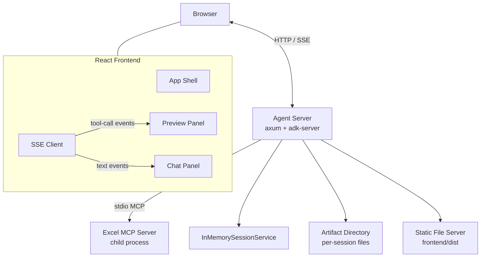
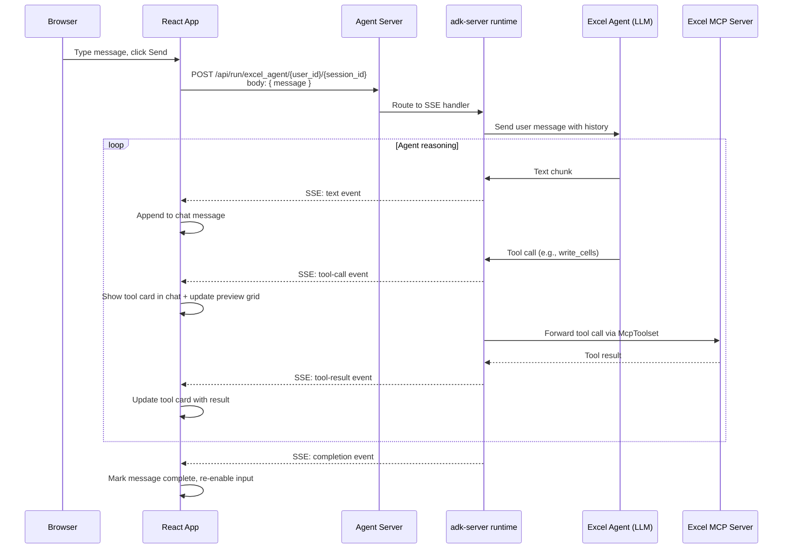
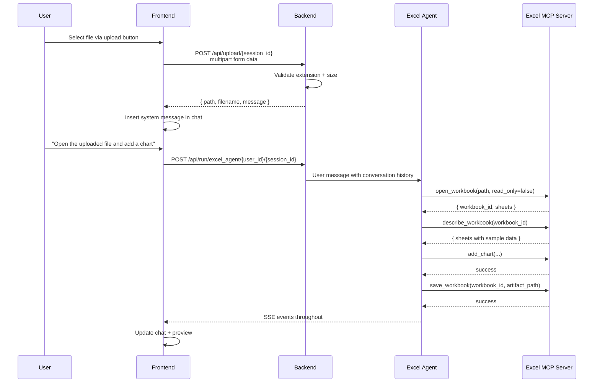

# Design Document: Excel Agent App

## Overview

The Excel Agent App is a full-stack application that lets users create, edit, and style Excel files through natural language conversation. It consists of:

- A **Rust backend** built on `adk-rust` v0.5.0 that hosts an LLM agent connected to the Excel MCP server via stdio, exposes an HTTP API with SSE streaming, manages sessions and artifacts, and serves the React frontend as static files.
- A **React frontend** (TypeScript, Vite, Tailwind CSS) that provides a split-pane UI with a chat panel and a live spreadsheet preview, consuming SSE events to render agent responses and tool activity in real time.

The backend spawns the Excel MCP server binary as a child process, wraps its tools in an `McpToolset`, and feeds them to an `LlmAgentBuilder`-configured agent. The adk-server framework handles SSE streaming, session management, and the core HTTP routing. Custom axum endpoints handle file upload, artifact download, and static asset serving.

### Key Design Decisions

1. **Single-process deployment**: The backend serves both the API and the built frontend assets, so production requires only one binary plus the MCP server child process.

2. **MCP server as child process**: The Excel MCP server is spawned via `TokioChildProcess` and connected over stdio. This keeps the two binaries decoupled — the MCP server can be developed and tested independently.

3. **SSE for real-time streaming**: The adk-server's built-in SSE endpoint streams text chunks, tool-call events, and tool-result events. The frontend parses these events to update both the chat and the spreadsheet preview simultaneously.

4. **Client-side spreadsheet state**: The frontend reconstructs spreadsheet state by interpreting tool-call and tool-result SSE events (e.g., `write_cells`, `set_cell_format`). This avoids a separate "get current state" API call and gives instant visual feedback as the agent works.

5. **Artifact directory for file exchange**: The agent saves workbooks to a session-scoped artifact directory. The backend maps files in this directory to downloadable endpoints. Uploaded files are also placed here so the agent can open them.

## Architecture



### Request Flow: User Message → Agent Response



### Backend Module Structure

```
src/
├── main.rs              # Entry point: parse config, spawn MCP server, build agent, start HTTP server
├── config.rs            # Environment variable parsing: model provider, ports, paths, security mode
├── agent.rs             # LlmAgentBuilder setup, system instruction, McpToolset creation
├── mcp.rs               # TokioChildProcess spawn, MCP client connection, health monitoring
├── routes/
│   ├── mod.rs           # Merge adk-server routes with custom routes
│   ├── upload.rs        # POST /api/upload — multipart file upload handler
│   ├── artifacts.rs     # GET /api/artifacts/{session_id}/{filename} — file download
│   └── health.rs        # Extended health check (MCP process status)
├── artifacts.rs         # Artifact directory management, path resolution, file mapping
└── static_files.rs      # Serve frontend/dist, SPA fallback to index.html
```

### Frontend Component Hierarchy

```
src/
├── main.tsx                 # React entry point
├── App.tsx                  # Layout shell: toolbar + split pane
├── components/
│   ├── Toolbar.tsx          # App title, session controls, model indicator
│   ├── ChatPanel/
│   │   ├── ChatPanel.tsx    # Message list + input area
│   │   ├── MessageList.tsx  # Scrollable message container
│   │   ├── UserMessage.tsx  # User message bubble
│   │   ├── AgentMessage.tsx # Agent message with streaming text
│   │   ├── ToolCard.tsx     # Collapsible tool-call/result display
│   │   └── ChatInput.tsx    # Text input + send button + upload button
│   ├── PreviewPanel/
│   │   ├── PreviewPanel.tsx # Container with toolbar + grid + sheet tabs
│   │   ├── SpreadsheetGrid.tsx  # Virtual grid: column headers, row numbers, cells
│   │   ├── SheetTabs.tsx    # Tab bar for switching sheets
│   │   └── CellRenderer.tsx # Renders a cell with formatting (bold, color, etc.)
│   └── common/
│       ├── Toast.tsx        # Toast notification component
│       ├── SplitPane.tsx    # Resizable split pane
│       └── ErrorBanner.tsx  # Connection error banner with retry
├── hooks/
│   ├── useSSE.ts            # SSE connection, event parsing, state dispatch
│   ├── useSession.ts        # Session creation, restoration from localStorage
│   ├── useSpreadsheetState.ts  # Reduces tool events into spreadsheet model
│   └── useFileUpload.ts     # Upload handler with progress tracking
├── services/
│   ├── api.ts               # HTTP client: session CRUD, upload, download, health
│   └── sseParser.ts         # Parse SSE event data into typed event objects
├── types/
│   ├── events.ts            # SSE event types: TextEvent, ToolCallEvent, ToolResultEvent, etc.
│   ├── spreadsheet.ts       # SpreadsheetState, Sheet, Cell, CellFormat types
│   └── session.ts           # Session types
└── utils/
    ├── cellRef.ts           # A1 notation parser (mirrors backend cell_ref.rs)
    └── formatters.ts        # Display helpers for tool args, cell values
```

## Components and Interfaces

### Backend Components

#### Config (`config.rs`)

Reads all configuration from environment variables at startup.

```rust
pub struct AppConfig {
    pub host: String,                    // HOST, default "0.0.0.0"
    pub port: u16,                       // PORT, default 3000
    pub model_provider: ModelProvider,   // MODEL_PROVIDER
    pub mcp_server_path: String,         // MCP_SERVER_PATH, default "./excel-mcp-server"
    pub artifact_dir: String,            // ARTIFACT_DIR, default "./artifacts"
    pub static_dir: String,             // STATIC_DIR, default "./frontend/dist"
    pub environment: Environment,        // ENVIRONMENT, default Development
    pub allowed_origins: Vec<String>,    // ALLOWED_ORIGINS (comma-separated, production only)
}

pub enum ModelProvider {
    Gemini { api_key: String, model: String },
    OpenAi { api_key: String, model: String },
    Anthropic { api_key: String, model: String },
}

pub enum Environment {
    Development,
    Production,
}

impl AppConfig {
    pub fn from_env() -> Result<Self, ConfigError>;
}
```

#### MCP Server Lifecycle (`mcp.rs`)

Spawns the Excel MCP server and creates the MCP client connection. Includes crash recovery with up to 3 restart attempts.

```rust
use adk::tools::mcp_toolset::McpToolset;
use adk::tools::mcp_toolset::TokioChildProcess;

const MAX_RESTART_ATTEMPTS: u32 = 3;

pub async fn spawn_mcp_server(path: &str) -> Result<(McpToolset, tokio::process::Child)> {
    let child_process = TokioChildProcess::new(
        tokio::process::Command::new(path)
            .stdin(std::process::Stdio::piped())
            .stdout(std::process::Stdio::piped())
            .stderr(std::process::Stdio::piped())
    )?;
    
    let client = child_process.connect().await?;
    let toolset = McpToolset::new(client);
    Ok((toolset, child_process.into_inner()))
}

/// Monitors the MCP child process and attempts to respawn on crash.
/// After MAX_RESTART_ATTEMPTS consecutive failures, reports critical status.
pub async fn monitor_and_respawn(
    path: String,
    child: tokio::process::Child,
    health_status: Arc<RwLock<McpHealthStatus>>,
) {
    // Background task: wait for child exit, attempt respawn, update health status
}

pub enum McpHealthStatus {
    Healthy,
    Degraded { reason: String },
    Critical { reason: String },
}
```

#### Agent Builder (`agent.rs`)

Configures the LLM agent with the model provider, system instruction, and MCP toolset.

```rust
use adk::agents::LlmAgentBuilder;

pub fn build_agent(
    config: &AppConfig,
    toolset: McpToolset,
) -> Result<impl AgentLoader> {
    let model = match &config.model_provider {
        ModelProvider::Gemini { api_key, model } => {
            GeminiModel::new(api_key, model)
        }
        ModelProvider::OpenAi { api_key, model } => {
            OpenAiModel::new(api_key, model)
        }
        ModelProvider::Anthropic { api_key, model } => {
            AnthropicModel::new(api_key, model)
        }
    };

    let agent = LlmAgentBuilder::new("excel_agent")
        .model(model)
        .instruction(system_instruction(&config.artifact_dir))
        .toolset(toolset)
        .build();

    Ok(agent)
}

fn system_instruction(artifact_dir: &str) -> String {
    format!(r#"You are an Excel specialist agent. You can create, edit, format, and analyze Excel files using the tools available to you.

## Available Tool Categories
- **Workbook lifecycle**: create_workbook, open_workbook, save_workbook, close_workbook
- **Reading data**: read_sheet, read_cell, describe_workbook, list_sheets, get_sheet_dimensions, search_cells, sheet_to_csv
- **Writing data**: write_cells, write_row, write_column
- **Formatting**: set_cell_format, merge_cells
- **Charts**: add_chart
- **Images**: add_image
- **Tables**: add_table
- **Conditional formatting**: add_conditional_format
- **Data validation**: add_data_validation
- **Layout**: set_column_width, set_row_height, freeze_panes
- **Sparklines**: add_sparkline
- **Sheet management**: add_sheet, rename_sheet, delete_sheet

## Workflow
1. Create a new workbook with `create_workbook` or open an existing one with `open_workbook`
2. Perform the requested operations (write data, format cells, add charts, etc.)
3. Always save the completed workbook using `save_workbook` with the path: {artifact_dir}/{{filename}}.xlsx

## Important Rules
- Always save completed workbooks to the artifact directory: {artifact_dir}/
- When creating files, use descriptive filenames based on the user's request
- After saving, confirm the filename so the user knows they can download it
- When opening uploaded files, the file path will be provided in the conversation. Uploaded files are stored at: {artifact_dir}/{{session_id}}/{{filename}}
- **Write-only limitation**: Workbooks created via `create_workbook` use a write-only engine. Do NOT call `read_sheet`, `read_cell`, or `describe_workbook` on them — track your own writes instead. If you need to read back data, save the workbook first, then reopen it with `open_workbook`.
- **Workbook TTL**: Workbook handles expire after 30 minutes of inactivity. If a workbook_id becomes invalid (evicted error), reopen the file with `open_workbook`.
"#)
}
```

#### Server Setup (`main.rs`)

Wires everything together: config, MCP server, agent, adk-server, custom routes.

```rust
#[tokio::main]
async fn main() -> Result<()> {
    tracing_subscriber::init();

    let config = AppConfig::from_env().unwrap_or_else(|e| {
        tracing::error!("Configuration error: {e}");
        std::process::exit(1);
    });

    // Spawn MCP server
    let (toolset, _mcp_child) = mcp::spawn_mcp_server(&config.mcp_server_path)
        .await
        .unwrap_or_else(|e| {
            tracing::error!("Failed to start Excel MCP server: {e}");
            std::process::exit(1);
        });

    // Build agent
    let agent = agent::build_agent(&config, toolset)?;

    // Configure adk-server
    let session_service = InMemorySessionService::new();
    let security = match config.environment {
        Environment::Development => SecurityConfig::development(),
        Environment::Production => SecurityConfig::production(config.allowed_origins.clone()),
    };

    let server_config = ServerConfig::new(agent, session_service)
        .with_security(security);

    let adk_app = create_app(server_config);

    // Merge custom routes
    let app = adk_app
        .route("/api/upload/:session_id", post(routes::upload::handle_upload))
        .route("/api/artifacts/:session_id/:filename", get(routes::artifacts::serve_artifact))
        .fallback_service(static_files::serve(&config.static_dir));

    let addr = format!("{}:{}", config.host, config.port);
    tracing::info!("Server listening on {addr}");
    axum::Server::bind(&addr.parse()?)
        .serve(app.into_make_service())
        .await?;

    Ok(())
}
```

#### Upload Handler (`routes/upload.rs`)

Handles multipart file upload with validation.

```rust
const MAX_UPLOAD_SIZE: usize = 50 * 1024 * 1024; // 50 MB
const ALLOWED_EXTENSIONS: &[&str] = &["xlsx", "xlsm", "xls", "ods"];

pub async fn handle_upload(
    State(artifact_dir): State<Arc<String>>,
    Path(session_id): Path<String>,
    mut multipart: Multipart,
) -> Result<Json<UploadResponse>, AppError> {
    let field = multipart.next_field().await?
        .ok_or(AppError::BadRequest("No file field in request"))?;

    let filename = field.file_name()
        .ok_or(AppError::BadRequest("Missing filename"))?
        .to_string();

    // Validate extension
    let ext = Path::new(&filename).extension()
        .and_then(|e| e.to_str())
        .ok_or(AppError::BadRequest("Missing file extension"))?;
    if !ALLOWED_EXTENSIONS.contains(&ext.to_lowercase().as_str()) {
        return Err(AppError::BadRequest(
            format!("Unsupported format. Supported: {}", ALLOWED_EXTENSIONS.join(", "))
        ));
    }

    // Read with size limit
    let data = field.bytes().await?;
    if data.len() > MAX_UPLOAD_SIZE {
        return Err(AppError::PayloadTooLarge("File exceeds 50 MB limit"));
    }

    // Save to artifact directory
    let artifact_path = format!("{}/{}/{}", artifact_dir, session_id, filename);
    tokio::fs::create_dir_all(&format!("{}/{}", artifact_dir, session_id)).await?;
    tokio::fs::write(&artifact_path, &data).await?;

    Ok(Json(UploadResponse {
        path: artifact_path,
        filename,
        message: "File uploaded successfully. Tell the agent to open it.".into(),
    }))
}
```

#### Artifact Serving (`routes/artifacts.rs`)

Serves files from the artifact directory with proper content-type headers.

```rust
pub async fn serve_artifact(
    State(artifact_dir): State<Arc<String>>,
    Path((session_id, filename)): Path<(String, String)>,
) -> Result<impl IntoResponse, AppError> {
    let path = format!("{}/{}/{}", artifact_dir, session_id, filename);
    let path = std::path::Path::new(&path);

    if !path.exists() {
        return Err(AppError::NotFound("Artifact not found"));
    }

    let bytes = tokio::fs::read(path).await?;
    let content_type = match path.extension().and_then(|e| e.to_str()) {
        Some("xlsx") => "application/vnd.openxmlformats-officedocument.spreadsheetml.sheet",
        Some("xlsm") => "application/vnd.ms-excel.sheet.macroEnabled.12",
        Some("xls") => "application/vnd.ms-excel",
        Some("ods") => "application/vnd.oasis.opendocument.spreadsheet",
        _ => "application/octet-stream",
    };

    Ok((
        [(header::CONTENT_TYPE, content_type),
         (header::CONTENT_DISPOSITION, &format!("attachment; filename=\"{}\"", filename))],
        bytes,
    ))
}
```

#### Static File Serving (`static_files.rs`)

Serves the React build output with SPA fallback.

```rust
pub fn serve(static_dir: &str) -> Router {
    let static_dir = PathBuf::from(static_dir);
    if !static_dir.exists() {
        tracing::warn!("Static directory {:?} not found, API-only mode", static_dir);
    }
    
    Router::new()
        .fallback(get(|req: Request<Body>| async move {
            let path = static_dir.join(req.uri().path().trim_start_matches('/'));
            if path.exists() && path.is_file() {
                serve_file(path).await
            } else {
                // SPA fallback: serve index.html for client-side routing
                serve_file(static_dir.join("index.html")).await
            }
        }))
}
```

### Frontend Components

#### SSE Hook (`hooks/useSSE.ts`)

The core hook that manages the SSE connection and dispatches events.

```typescript
interface SSEEvent {
  type: 'text' | 'tool-call' | 'tool-result' | 'completion' | 'error';
  data: TextEvent | ToolCallEvent | ToolResultEvent | CompletionEvent | ErrorEvent;
}

interface ToolCallEvent {
  toolName: string;
  arguments: Record<string, unknown>;
  callId: string;
}

interface ToolResultEvent {
  callId: string;
  result: string; // JSON string from MCP server
}

function useSSE(sessionId: string) {
  const [isStreaming, setIsStreaming] = useState(false);
  const [events, setEvents] = useState<SSEEvent[]>([]);

  const sendMessage = useCallback(async (message: string) => {
    setIsStreaming(true);
    const response = await fetch(
      `/api/run/excel_agent/${userId}/${sessionId}`,
      { method: 'POST', body: JSON.stringify({ message }), headers: { 'Content-Type': 'application/json' } }
    );

    const reader = response.body!.getReader();
    const decoder = new TextDecoder();
    // Parse SSE stream, dispatch events
    // On completion or error: setIsStreaming(false)
  }, [sessionId]);

  return { isStreaming, events, sendMessage };
}
```

#### Spreadsheet State Hook (`hooks/useSpreadsheetState.ts`)

Reduces SSE tool events into a spreadsheet model for the preview panel.

```typescript
interface SpreadsheetState {
  sheets: Map<string, Sheet>;
  activeSheet: string;
}

interface Sheet {
  name: string;
  cells: Map<string, Cell>; // key: "A1", "B2", etc.
  mergedRanges: string[];
}

interface Cell {
  value: string | number | boolean | null;
  format?: CellFormat;
}

interface CellFormat {
  bold?: boolean;
  italic?: boolean;
  fontColor?: string;
  backgroundColor?: string;
  fontSize?: number;
}

// Tool events that modify spreadsheet state:
const WRITE_TOOLS = ['write_cells', 'write_row', 'write_column'];
const FORMAT_TOOLS = ['set_cell_format', 'merge_cells'];
const SHEET_TOOLS = ['add_sheet', 'rename_sheet', 'delete_sheet'];
const WORKBOOK_TOOLS = ['create_workbook'];

function useSpreadsheetState(events: SSEEvent[]): SpreadsheetState {
  return useMemo(() => {
    const state: SpreadsheetState = { sheets: new Map(), activeSheet: '' };
    
    for (const event of events) {
      if (event.type === 'tool-call') {
        const { toolName, arguments: args } = event.data as ToolCallEvent;
        
        if (toolName === 'create_workbook') {
          state.sheets.set('Sheet1', { name: 'Sheet1', cells: new Map(), mergedRanges: [] });
          state.activeSheet = 'Sheet1';
        }
        
        if (WRITE_TOOLS.includes(toolName)) {
          applyWriteEvent(state, toolName, args);
        }
        
        if (FORMAT_TOOLS.includes(toolName)) {
          applyFormatEvent(state, toolName, args);
        }
        
        if (SHEET_TOOLS.includes(toolName)) {
          applySheetEvent(state, toolName, args);
        }
      }
    }
    
    return state;
  }, [events]);
}
```

#### SpreadsheetGrid Component

Renders the virtual grid with column headers, row numbers, and cell values.

```typescript
interface SpreadsheetGridProps {
  sheet: Sheet;
}

function SpreadsheetGrid({ sheet }: SpreadsheetGridProps) {
  // Determine grid bounds from populated cells
  const { maxRow, maxCol } = useMemo(() => computeBounds(sheet.cells), [sheet.cells]);

  return (
    <div className="overflow-auto h-full">
      <table className="border-collapse text-sm">
        <thead>
          <tr>
            <th className="sticky top-0 left-0 z-20 bg-gray-100 border w-10" />
            {Array.from({ length: maxCol + 1 }, (_, i) => (
              <th key={i} className="sticky top-0 z-10 bg-gray-100 border px-2 min-w-[80px]">
                {indexToColLetter(i)}
              </th>
            ))}
          </tr>
        </thead>
        <tbody>
          {Array.from({ length: maxRow + 1 }, (_, row) => (
            <tr key={row}>
              <td className="sticky left-0 z-10 bg-gray-100 border text-center text-gray-500">
                {row + 1}
              </td>
              {Array.from({ length: maxCol + 1 }, (_, col) => {
                const ref = `${indexToColLetter(col)}${row + 1}`;
                const cell = sheet.cells.get(ref);
                return <CellRenderer key={ref} cell={cell} />;
              })}
            </tr>
          ))}
        </tbody>
      </table>
    </div>
  );
}
```


## Data Models

### Backend Data Models

#### SSE Event Types

The adk-server streams events in a standard SSE format. Each event has a `type` field and a `data` payload:

| Event Type | Payload | Description |
|---|---|---|
| `text` | `{ content: string }` | A chunk of the agent's text response |
| `tool-call` | `{ callId: string, toolName: string, arguments: object }` | Agent is invoking an MCP tool |
| `tool-result` | `{ callId: string, result: string }` | MCP tool returned a result |
| `completion` | `{}` | Agent execution finished |
| `error` | `{ message: string }` | An error occurred during execution |

#### Upload/Download Types

```rust
#[derive(Serialize)]
pub struct UploadResponse {
    pub path: String,
    pub filename: String,
    pub message: String,
}

#[derive(Serialize)]
pub struct ErrorResponse {
    pub error: String,
    pub detail: Option<String>,
}
```

#### Session Types

Sessions are managed by `InMemorySessionService` from adk-rust. The frontend interacts with sessions via:

- `POST /api/sessions` — create a new session, returns `{ session_id, user_id }`
- `GET /api/sessions` — list active sessions

### Frontend Data Models

#### Spreadsheet State Model

The frontend maintains a client-side spreadsheet model reconstructed from SSE events:

```typescript
// Core spreadsheet state
interface SpreadsheetState {
  sheets: Map<string, Sheet>;
  activeSheet: string;
  savedArtifact: ArtifactInfo | null;
}

interface Sheet {
  name: string;
  cells: Map<string, Cell>;       // keyed by A1 reference
  mergedRanges: string[];          // ["A1:C1", "B5:B10"]
  columnWidths: Map<string, number>;
  rowHeights: Map<number, number>;
}

interface Cell {
  value: string | number | boolean | null;
  formula?: string;
  format?: CellFormat;
}

interface CellFormat {
  bold?: boolean;
  italic?: boolean;
  underline?: boolean;
  fontSize?: number;
  fontColor?: string;        // hex "#RRGGBB"
  backgroundColor?: string;  // hex "#RRGGBB"
  horizontalAlignment?: 'left' | 'center' | 'right';
  verticalAlignment?: 'top' | 'center' | 'bottom';
  numberFormat?: string;
}

interface ArtifactInfo {
  sessionId: string;
  filename: string;
  downloadUrl: string;
}
```

#### Chat State Model

```typescript
interface ChatState {
  messages: ChatMessage[];
  isStreaming: boolean;
  error: string | null;
}

type ChatMessage = UserMessage | AgentMessage | SystemMessage;

interface UserMessage {
  type: 'user';
  content: string;
  timestamp: number;
}

interface AgentMessage {
  type: 'agent';
  content: string;           // accumulated text chunks
  toolCalls: ToolCallInfo[];
  isComplete: boolean;
  timestamp: number;
}

interface SystemMessage {
  type: 'system';
  content: string;
  timestamp: number;
}

interface ToolCallInfo {
  callId: string;
  toolName: string;
  arguments: Record<string, unknown>;
  result?: string;
  isExpanded: boolean;
}
```

#### Session State Model

```typescript
interface SessionState {
  currentSessionId: string | null;
  userId: string;  // UUID v4, generated on first visit
}

// Persisted to localStorage:
// - "excel_agent_session_id": current session ID
// - "excel_agent_user_id": user ID (UUID v4, generated once on first visit, reused for all sessions)
```

The `useSession` hook generates a UUID v4 for `userId` on first visit using `crypto.randomUUID()` and stores it in localStorage. On subsequent visits, it reads the stored value. This ensures a stable user identity across sessions without requiring authentication.

### Tool-to-Preview Mapping

The `useSpreadsheetState` hook maps tool-call events to spreadsheet state mutations:

| Tool Name | State Mutation |
|---|---|
| `create_workbook` | Initialize state with one sheet "Sheet1" |
| `write_cells` | Set cell values from the `cells` array argument |
| `write_row` | Set consecutive cell values in a row from `start_cell` |
| `write_column` | Set consecutive cell values in a column from `start_cell` |
| `set_cell_format` | Apply format properties to cells in the `range` |
| `merge_cells` | Add range to `mergedRanges`, keep top-left cell value |
| `add_sheet` | Add new empty sheet to state |
| `rename_sheet` | Rename sheet key in the map |
| `delete_sheet` | Remove sheet from state |
| `set_column_width` | Update `columnWidths` map |
| `set_row_height` | Update `rowHeights` map |
| `save_workbook` | On tool-result success, set `savedArtifact` with filename |
| `open_workbook` | On tool-result, parse sheet info and initialize state |

For `open_workbook`, the tool-result contains sheet names and dimensions. The frontend initializes empty sheets and then relies on subsequent `read_sheet` / `describe_workbook` calls (which the agent typically makes) to populate cell data.

### Preview Panel Limitations

The preview panel renders a best-effort representation of the spreadsheet. The following features are NOT rendered in the preview but will be present in the downloaded Excel file:

- Charts (`add_chart`)
- Images (`add_image`)
- Excel Tables (`add_table`)
- Conditional formatting (`add_conditional_format`)
- Data validation (`add_data_validation`)
- Sparklines (`add_sparkline`)
- Freeze panes (`freeze_panes`) — visual indicator only

When the agent invokes these tools, the preview panel shows the tool card in the chat but does not attempt to render the visual result. A persistent notice in the preview toolbar informs the user that the downloaded file contains additional formatting not shown in the preview.

### Shared Response Contract (MCP Server → Frontend)

The frontend parses tool-result SSE events to extract state for certain operations. These tool results follow the MCP server's structured JSON format (`{ status, message, data }`). The frontend depends on the following `data` shapes:

| Tool | Expected `data` shape in tool-result |
|---|---|
| `create_workbook` | `WorkbookInfo { workbook_id, engine, sheets: [{ name, dimensions, row_count, col_count }] }` |
| `open_workbook` | `WorkbookInfo { workbook_id, engine, sheets: [{ name, dimensions, row_count, col_count }] }` |
| `save_workbook` | `{ file_path }` (used to construct download URL) |
| `write_cells` | `WriteResult { cells_written, range_covered }` |
| `describe_workbook` | `WorkbookDescription { sheets: [{ name, dimensions, sample_rows }] }` |

The frontend extracts the `data` field from the JSON string in the tool-result event. If parsing fails, the tool card displays the raw result string.

### Data Flow: File Upload → Agent Processing




## Correctness Properties

*A property is a characteristic or behavior that should hold true across all valid executions of a system — essentially, a formal statement about what the system should do. Properties serve as the bridge between human-readable specifications and machine-verifiable correctness guarantees.*

### Property 1: Model provider parsing accepts only valid values

*For any* string value of the `MODEL_PROVIDER` environment variable, the config parser should return a valid `ModelProvider` if and only if the value is one of "gemini", "openai", or "anthropic" (case-sensitive). All other strings should produce a configuration error.

**Validates: Requirements 2.1**

### Property 2: Missing API key produces error naming the variable

*For any* valid model provider selection ("gemini", "openai", "anthropic"), if the corresponding API key environment variable (`GOOGLE_API_KEY`, `OPENAI_API_KEY`, `ANTHROPIC_API_KEY` respectively) is not set, the config parser should return an error whose message contains the name of the missing variable.

**Validates: Requirements 2.5**

### Property 3: File extension validation

*For any* filename, the upload handler should accept the file if and only if its extension (case-insensitive) is one of "xlsx", "xlsm", "xls", or "ods". Files with any other extension (or no extension) should be rejected with an HTTP 400 response.

**Validates: Requirements 6.2, 6.6**

### Property 4: Upload stores file and returns correct path

*For any* valid uploaded file (valid extension, under 50 MB), the upload handler should store the file in the session's artifact directory and return a response containing the file path that, when read from disk, yields the same bytes as the uploaded file.

**Validates: Requirements 6.3, 6.4**

### Property 5: Upload size limit enforcement

*For any* file whose size exceeds 50 MB, the upload handler should reject the upload with an HTTP 413 response, regardless of the file's extension or content.

**Validates: Requirements 6.5**

### Property 6: Text event concatenation

*For any* sequence of SSE text events received during a single agent response, the displayed agent message content should equal the concatenation of all text event `content` fields in the order they were received.

**Validates: Requirements 10.4**

### Property 7: Tool-call events produce complete tool cards

*For any* SSE tool-call event, the Chat Panel should render a tool card that contains the tool name and all argument key-value pairs from the event's `arguments` object.

**Validates: Requirements 10.5**

### Property 8: Spreadsheet grid renders all populated cells

*For any* `SpreadsheetState` with populated cells, the rendered grid should contain a cell element for every entry in the sheet's `cells` map, and each cell element's displayed value should match the cell's `value` field.

**Validates: Requirements 11.1**

### Property 9: Write tool events update preview state

*For any* SSE tool-call event where the tool name is one of `write_cells`, `write_row`, `write_column`, `set_cell_format`, `merge_cells`, `add_sheet`, `rename_sheet`, or `delete_sheet`, the `useSpreadsheetState` reducer should produce a state that reflects the operation described by the tool's arguments (e.g., after a `write_cells` event, the state's cells map contains the written values at the specified references).

**Validates: Requirements 11.2, 11.3**

### Property 10: Sheet tabs match sheet count

*For any* `SpreadsheetState` containing N sheets where N > 1, the Preview Panel should render exactly N sheet tabs, each labeled with the corresponding sheet name.

**Validates: Requirements 11.4**

### Property 11: Cell formatting reflected in rendering

*For any* cell with a non-empty `CellFormat`, the rendered cell element should reflect the format properties: bold text should have `font-weight: bold`, italic should have `font-style: italic`, `fontColor` should map to the CSS `color` property, and `backgroundColor` should map to the CSS `background-color` property.

**Validates: Requirements 11.5**

### Property 12: Successful save produces download button

*For any* SSE tool-call event with tool name `save_workbook` followed by a tool-result event indicating success, the Chat Panel should render a download button associated with that agent message.

**Validates: Requirements 12.1**

### Property 13: Session ID round-trips through localStorage

*For any* valid session ID string, after the session hook stores it to localStorage, reloading the hook (simulating page refresh) should restore the same session ID.

**Validates: Requirements 14.3, 14.4**

### Property 14: Non-API routes serve index.html (SPA fallback)

*For any* HTTP GET request whose path does not start with `/api/`, the static file server should return the contents of `index.html` (unless the path matches an actual static file on disk).

**Validates: Requirements 16.2**

### Property 15: Artifact round trip — saved files are downloadable

*For any* file written to a session's artifact directory, a GET request to `/api/artifacts/{session_id}/{filename}` should return the file contents with the correct content-type header for the file's extension.

**Validates: Requirements 18.3**

## Error Handling

### Backend Error Handling

The backend uses a layered error handling approach:

1. **Startup errors** (config, MCP spawn): Log to stderr via `tracing::error!` and exit with non-zero code. These are unrecoverable.

2. **Request-level errors**: Custom `AppError` enum that implements `IntoResponse` for axum:

```rust
pub enum AppError {
    BadRequest(String),        // 400
    NotFound(String),          // 404
    PayloadTooLarge(String),   // 413
    Internal(String),          // 500
}

impl IntoResponse for AppError {
    fn into_response(self) -> Response {
        let (status, message) = match self {
            AppError::BadRequest(m) => (StatusCode::BAD_REQUEST, m),
            AppError::NotFound(m) => (StatusCode::NOT_FOUND, m),
            AppError::PayloadTooLarge(m) => (StatusCode::PAYLOAD_TOO_LARGE, m),
            AppError::Internal(m) => (StatusCode::INTERNAL_SERVER_ERROR, m),
        };
        (status, Json(ErrorResponse { error: message, detail: None })).into_response()
    }
}
```

3. **MCP server crash**: The backend monitors the child process handle. If the process exits unexpectedly, it attempts to respawn up to 3 times. During respawn attempts, the health endpoint reports degraded status. After 3 consecutive failures, it reports critical status. SSE requests that try to invoke tools during a crash will receive an error event in the stream advising the user to retry shortly.

4. **SSE stream errors**: If the agent or MCP server errors during streaming, the adk-server runtime sends an error SSE event and closes the stream. The frontend handles this gracefully.

### Frontend Error Handling

1. **Connection errors**: On initial load, the app pings `/api/health`. If unreachable, an `ErrorBanner` with a retry button is shown. The banner persists until a successful health check.

2. **SSE stream errors**: The `useSSE` hook catches fetch errors and stream interruptions. On error, it sets `isStreaming = false`, appends an error indicator to the current agent message, and re-enables the input.

3. **Upload/download errors**: The `useFileUpload` hook and download handler catch HTTP errors and display them as toast notifications that auto-dismiss after 5 seconds.

4. **Session errors**: If session creation fails, a toast notification is shown. The app continues to function with the existing session if available.

### Error Categories and User Feedback

| Error Scenario | Backend Response | Frontend Display |
|---|---|---|
| Upload: bad extension | 400 + supported formats list | Toast with supported formats |
| Upload: too large | 413 + size limit message | Toast with size limit |
| Download: artifact not found | 404 + descriptive message | Toast with error |
| SSE: stream interrupted | Error SSE event | Warning in chat + input re-enabled |
| Server unreachable | N/A (connection refused) | Error banner with retry |
| Session creation failed | 500 | Toast notification |
| MCP server crashed | Degraded health + auto-respawn (up to 3 attempts), then critical | Error in agent response, retry suggestion |

## Testing Strategy

### Dual Testing Approach

The testing strategy uses both unit tests and property-based tests:

- **Unit tests**: Verify specific examples, edge cases, integration points, and error conditions
- **Property-based tests**: Verify universal properties across randomly generated inputs

### Backend Testing

**Unit Tests (Rust)**:
- Config parsing: specific valid/invalid environment variable combinations
- Upload handler: specific file types, boundary sizes (exactly 50MB, 50MB+1)
- Artifact serving: existing file, missing file, various content types
- Static file serving: existing static file, missing file (SPA fallback), API route passthrough
- System instruction: contains required keywords and artifact directory path
- MCP spawn error handling: invalid binary path

**Property-Based Tests (Rust, using `proptest`)**:
- Each correctness property (1-5, 14-15) implemented as a `proptest` test
- Minimum 100 iterations per property
- Each test tagged with: `// Feature: excel-agent-app, Property {N}: {title}`

Example property test structure:
```rust
use proptest::prelude::*;

proptest! {
    #![proptest_config(ProptestConfig::with_cases(100))]

    // Feature: excel-agent-app, Property 1: Model provider parsing accepts only valid values
    #[test]
    fn prop_model_provider_parsing(input in "\\PC{1,20}") {
        let result = parse_model_provider(&input);
        let valid = ["gemini", "openai", "anthropic"];
        if valid.contains(&input.as_str()) {
            prop_assert!(result.is_ok());
        } else {
            prop_assert!(result.is_err());
        }
    }

    // Feature: excel-agent-app, Property 3: File extension validation
    #[test]
    fn prop_extension_validation(ext in "[a-z]{1,5}") {
        let filename = format!("test.{ext}");
        let result = validate_extension(&filename);
        let allowed = ["xlsx", "xlsm", "xls", "ods"];
        prop_assert_eq!(result.is_ok(), allowed.contains(&ext.as_str()));
    }
}
```

### Frontend Testing

**Unit Tests (TypeScript, using Vitest + React Testing Library)**:
- Component rendering: ChatPanel, PreviewPanel, Toolbar, ToolCard
- SSE event parsing: specific event payloads
- Cell reference parsing: specific A1 references
- Session localStorage: store and retrieve
- Empty states: no workbook, no messages

**Property-Based Tests (TypeScript, using `fast-check`)**:
- Each correctness property (6-13) implemented as a `fast-check` test
- Minimum 100 iterations per property
- Each test tagged with: `// Feature: excel-agent-app, Property {N}: {title}`

Example property test structure:
```typescript
import fc from 'fast-check';

// Feature: excel-agent-app, Property 6: Text event concatenation
test('text events concatenate into displayed message', () => {
  fc.assert(
    fc.property(
      fc.array(fc.string({ minLength: 0, maxLength: 200 }), { minLength: 1, maxLength: 20 }),
      (chunks) => {
        const events = chunks.map(c => ({ type: 'text' as const, data: { content: c } }));
        const result = reduceTextEvents(events);
        expect(result).toBe(chunks.join(''));
      }
    ),
    { numRuns: 100 }
  );
});

// Feature: excel-agent-app, Property 9: Write tool events update preview state
test('write_cells events populate spreadsheet state', () => {
  fc.assert(
    fc.property(
      fc.array(
        fc.record({
          cell: fc.tuple(
            fc.integer({ min: 0, max: 25 }).map(i => String.fromCharCode(65 + i)),
            fc.integer({ min: 1, max: 100 })
          ).map(([col, row]) => `${col}${row}`),
          value: fc.oneof(fc.string(), fc.integer(), fc.boolean()),
        }),
        { minLength: 1, maxLength: 50 }
      ),
      (cells) => {
        const event = {
          type: 'tool-call' as const,
          data: { toolName: 'write_cells', arguments: { sheet_name: 'Sheet1', cells } }
        };
        const state = reduceSpreadsheetEvents([createWorkbookEvent, event]);
        for (const cell of cells) {
          expect(state.sheets.get('Sheet1')?.cells.get(cell.cell)?.value).toBe(cell.value);
        }
      }
    ),
    { numRuns: 100 }
  );
});

// Feature: excel-agent-app, Property 13: Session ID round-trips through localStorage
test('session ID persists and restores from localStorage', () => {
  fc.assert(
    fc.property(
      fc.stringOf(fc.char().filter(c => c !== '\0'), { minLength: 1, maxLength: 64 }),
      (sessionId) => {
        persistSessionId(sessionId);
        const restored = restoreSessionId();
        expect(restored).toBe(sessionId);
      }
    ),
    { numRuns: 100 }
  );
});
```

### Test Organization

**Backend**:
```
tests/
├── config_test.rs          # Unit + property tests for config parsing (Properties 1, 2)
├── upload_test.rs           # Unit + property tests for upload validation (Properties 3, 4, 5)
├── artifacts_test.rs        # Unit + property tests for artifact serving (Property 15)
├── static_files_test.rs     # Unit + property tests for SPA fallback (Property 14)
└── integration/
    └── server_test.rs       # Full server integration tests
```

**Frontend**:
```
src/__tests__/
├── useSSE.test.ts           # Property tests for text concatenation (Property 6)
├── ToolCard.test.tsx         # Property tests for tool card rendering (Property 7)
├── SpreadsheetGrid.test.tsx  # Property tests for grid rendering (Property 8)
├── useSpreadsheetState.test.ts  # Property tests for state reduction (Properties 9, 10)
├── CellRenderer.test.tsx     # Property tests for formatting (Property 11)
├── ChatPanel.test.tsx        # Property tests for download button (Property 12)
├── useSession.test.ts        # Property tests for session persistence (Property 13)
└── components/               # Unit tests for specific examples and edge cases
```
