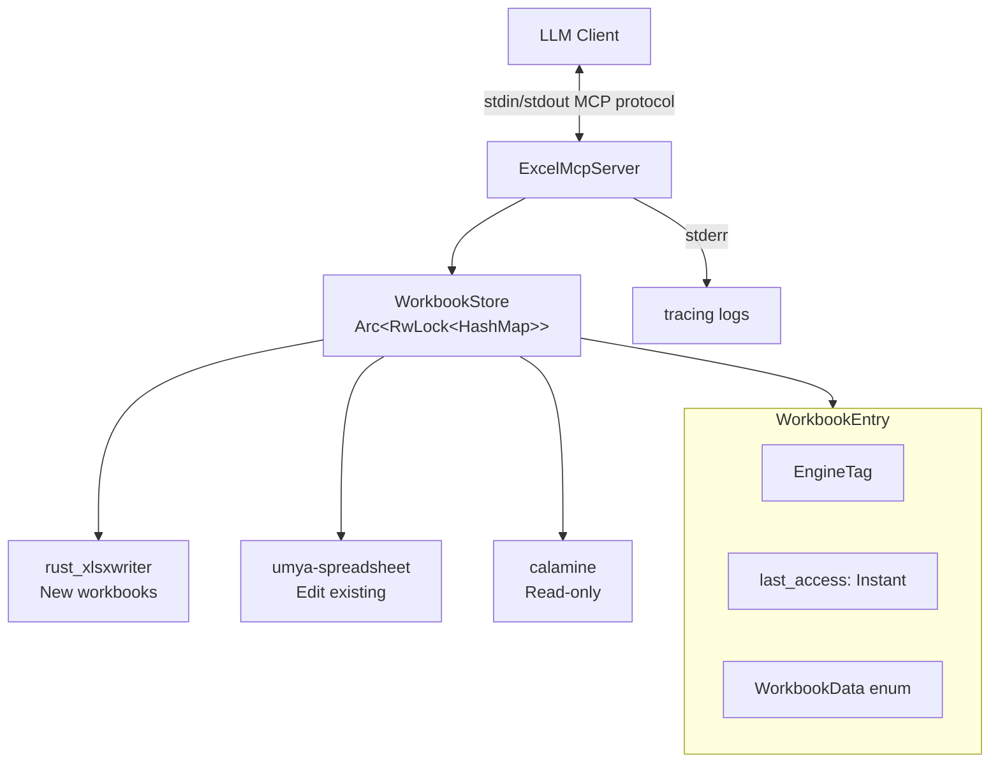
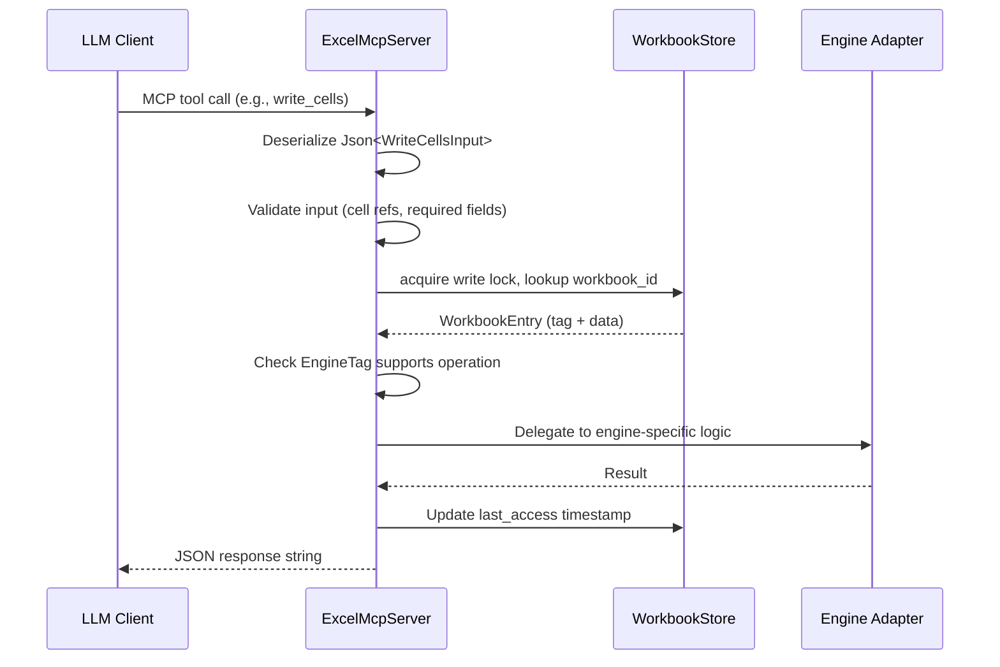

# Design Document: Excel MCP Server

## Overview

The Excel MCP Server is a Rust-based MCP server that exposes Excel file manipulation as tools callable by LLMs. It uses a hybrid engine architecture where three different Rust crates handle different workbook lifecycles:

- **rust_xlsxwriter** — creates new xlsx files with full feature support (charts, sparklines, conditional formatting, tables, images, data validation)
- **umya-spreadsheet** — reads and edits existing xlsx/xlsm files in-place
- **calamine** — provides fast, read-only access for analysis of xlsx/xls/ods files

The server communicates over stdio using the `rmcp` v1.3.0 SDK, holds workbooks in memory via a handle-based store, and routes operations to the correct engine based on how each workbook was opened. A TTL-based eviction policy prevents unbounded memory growth.

### Key Design Decisions

1. **Three engines instead of one**: No single Rust crate covers all use cases well. `rust_xlsxwriter` produces the richest new files but cannot read existing ones. `umya-spreadsheet` can read and edit but lacks sparklines. `calamine` is the fastest reader but is read-only. The hybrid approach gives LLMs the best capability at each stage.

2. **Handle-based stateful store**: Workbooks are held in memory and referenced by opaque IDs. This avoids re-reading files on every tool call and enables multi-step workflows (create → populate → format → save).

3. **Engine tag routing**: Each workbook carries an `EngineTag` discriminator. The server checks this tag before every operation to ensure the requested action is supported, returning actionable error messages when it isn't.

4. **Structured JSON responses**: Every tool returns a JSON string with `status`, `message`, and optional `data` fields. This gives LLMs a consistent parsing contract.

## Architecture



### Module Structure

```
src/
├── main.rs              # Entry point: init tracing, build server, run stdio transport
├── server.rs            # ExcelMcpServer struct, ServerHandler impl, tool dispatch
├── store.rs             # WorkbookStore, WorkbookEntry, EngineTag, eviction logic
├── engines/
│   ├── mod.rs           # Engine trait and common types
│   ├── rxw.rs           # rust_xlsxwriter engine adapter
│   ├── umya.rs          # umya-spreadsheet engine adapter
│   └── calamine.rs      # calamine engine adapter
├── tools/
│   ├── mod.rs           # Re-exports all tool modules
│   ├── workbook.rs      # create_workbook, open_workbook, save_workbook, close_workbook
│   ├── sheets.rs        # list_sheets, get_sheet_dimensions, describe_workbook, add/rename/delete_sheet
│   ├── read.rs          # read_sheet, read_cell, search_cells, sheet_to_csv
│   ├── write.rs         # write_cells, write_row, write_column
│   ├── format.rs        # set_cell_format, merge_cells
│   ├── charts.rs        # add_chart
│   ├── images.rs        # add_image
│   ├── tables.rs        # add_table
│   ├── conditional.rs   # add_conditional_format
│   ├── validation.rs    # add_data_validation
│   ├── layout.rs        # set_column_width, set_row_height, freeze_panes
│   └── sparklines.rs    # add_sparkline
├── types/
│   ├── mod.rs           # Re-exports
│   ├── inputs.rs        # All tool input structs (schemars + serde)
│   ├── responses.rs     # ToolResponse, ErrorCategory, structured response builders
│   └── enums.rs         # ChartType, AlignmentType, BorderStyle, ValidationRule, etc.
├── cell_ref.rs          # A1 notation parser: "B3" → (row=2, col=1), range parsing
└── error.rs             # ExcelMcpError enum, From impls, error categorization
```

### Request Flow



## Components and Interfaces

### ExcelMcpServer

The top-level server struct. Holds an `Arc<RwLock<WorkbookStore>>` and exposes all MCP tools via `#[tool(tool_box)]`.

```rust
#[derive(Debug, Clone)]
pub struct ExcelMcpServer {
    store: Arc<RwLock<WorkbookStore>>,
}

#[tool(tool_box)]
impl ServerHandler for ExcelMcpServer {
    fn name(&self) -> String { "excel-mcp".into() }
    fn instructions(&self) -> String {
        "Excel file manipulation tools. Create, read, edit, format, \
         and analyze Excel workbooks. Use create_workbook for new files, \
         open_workbook for existing files.".into()
    }
}
```

Each tool method follows this pattern:

```rust
#[tool(description = "Write values to multiple cells in a single batch operation")]
pub async fn write_cells(
    &self,
    #[tool(aggr)] input: Json<WriteCellsInput>,
) -> Result<String, anyhow::Error> {
    let input = input.0;
    // 1. Validate input
    // 2. Acquire store lock
    // 3. Check engine capability
    // 4. Delegate to engine adapter
    // 5. Update last_access
    // 6. Return structured JSON response
}
```

### WorkbookStore

Manages the lifecycle of all open workbooks.

```rust
pub struct WorkbookStore {
    workbooks: HashMap<String, WorkbookEntry>,
    max_capacity: usize,       // default: 10
    ttl: Duration,             // default: 30 minutes
}

impl WorkbookStore {
    pub fn insert(&mut self, entry: WorkbookEntry) -> Result<String, ExcelMcpError>;
    pub fn get(&self, id: &str) -> Option<&WorkbookEntry>;
    pub fn get_mut(&mut self, id: &str) -> Option<&mut WorkbookEntry>;
    pub fn remove(&mut self, id: &str) -> Option<WorkbookEntry>;
    pub fn evict_expired(&mut self) -> Vec<String>;  // returns evicted IDs
    pub fn open_ids(&self) -> Vec<String>;
    pub fn is_full(&self) -> bool;
}
```

### WorkbookEntry

A single workbook in the store.

```rust
pub struct WorkbookEntry {
    pub id: String,
    pub tag: EngineTag,
    pub data: WorkbookData,
    pub last_access: Instant,
    pub sheet_index_map: Option<HashMap<String, usize>>,  // for rust_xlsxwriter name→index tracking
}
```

### Engine Adapters

Each engine adapter module provides free functions that operate on the engine-specific workbook type. We don't use a trait object here because the three workbook types (`rust_xlsxwriter::Workbook`, `umya_spreadsheet::Spreadsheet`, `calamine::Xlsx<BufReader<File>>`) have fundamentally different APIs. Instead, the tool methods match on `EngineTag` and call the appropriate adapter.

```rust
// engines/rxw.rs — rust_xlsxwriter adapter
// NOTE: This engine is write-only. read_sheet, read_cell, describe_workbook (sample rows),
// and get_sheet_dimensions are NOT supported. The server returns an informative error
// directing the LLM to track its own writes or save and reopen in edit mode.
pub fn create_workbook() -> (rust_xlsxwriter::Workbook, HashMap<String, usize>);
pub fn write_cells(wb: &mut rust_xlsxwriter::Workbook, sheet_map: &mut HashMap<String, usize>, sheet: &str, cells: &[CellWrite]) -> Result<WriteResult>;
pub fn add_chart(wb: &mut rust_xlsxwriter::Workbook, sheet_map: &HashMap<String, usize>, sheet: &str, config: &ChartConfig) -> Result<()>;
pub fn save(wb: &mut rust_xlsxwriter::Workbook, path: &str) -> Result<()>;
// ... etc

// engines/umya.rs — umya-spreadsheet adapter
pub fn open_workbook(path: &str, lazy: bool) -> Result<umya_spreadsheet::Spreadsheet>;
pub fn write_cells(wb: &mut umya_spreadsheet::Spreadsheet, sheet: &str, cells: &[CellWrite]) -> Result<WriteResult>;
pub fn read_sheet(wb: &umya_spreadsheet::Spreadsheet, sheet: &str, range: Option<&str>, page: usize) -> Result<ReadResult>;
pub fn save(wb: &umya_spreadsheet::Spreadsheet, path: &str) -> Result<()>;
// ... etc

// engines/calamine.rs — calamine adapter
pub fn open_workbook(path: &str) -> Result<CalamineWorkbook>;
pub fn read_sheet(wb: &mut CalamineWorkbook, sheet: &str, range: Option<&str>, page: usize) -> Result<ReadResult>;
pub fn sheet_names(wb: &CalamineWorkbook) -> Vec<String>;
// ... etc
```

### Cell Reference Parser (`cell_ref.rs`)

Shared utility for converting between A1 notation and zero-based (row, col) indices.

```rust
pub struct CellPos { pub row: u32, pub col: u16 }
pub struct CellRange { pub start: CellPos, pub end: CellPos }

pub fn parse_cell_ref(s: &str) -> Result<CellPos, ExcelMcpError>;
pub fn parse_range_ref(s: &str) -> Result<CellRange, ExcelMcpError>;
pub fn col_letter_to_index(s: &str) -> Result<u16, ExcelMcpError>;
pub fn index_to_col_letter(col: u16) -> String;
pub fn cell_pos_to_a1(pos: &CellPos) -> String;
```

Parsing logic: split the string at the boundary between letters and digits. Letters (case-insensitive) map to column index via base-26 conversion. Digits map to row index (1-based in A1, converted to 0-based internally). Validates against Excel limits: max column XFD (16383), max row 1048576.

### Structured Responses (`types/responses.rs`)

```rust
#[derive(Serialize)]
pub struct ToolResponse<T: Serialize> {
    pub status: Status,
    pub message: String,
    #[serde(skip_serializing_if = "Option::is_none")]
    pub data: Option<T>,
}

#[derive(Serialize)]
#[serde(rename_all = "snake_case")]
pub enum Status { Success, Error }

#[derive(Serialize)]
pub struct ErrorData {
    pub category: ErrorCategory,
    pub description: String,
    pub suggestion: String,
}

#[derive(Serialize)]
#[serde(rename_all = "snake_case")]
pub enum ErrorCategory {
    NotFound,
    InvalidInput,
    EngineUnsupported,
    CapacityExceeded,
    IoError,
    ParseError,
    Evicted,
}

// Builder helpers
pub fn success<T: Serialize>(message: &str, data: T) -> String;
pub fn success_no_data(message: &str) -> String;
pub fn error(category: ErrorCategory, description: &str, suggestion: &str) -> String;
```

All tool methods return `Result<String, anyhow::Error>` where the `String` is always a serialized `ToolResponse`. Even error conditions from the domain (not found, invalid input, etc.) are returned as successful MCP responses containing error JSON — `anyhow::Error` is reserved for truly unexpected failures.


## Data Models

### Core Enums

```rust
/// Discriminates which engine owns a workbook
#[derive(Debug, Clone, Copy, PartialEq, Eq)]
pub enum EngineTag {
    RustXlsxWriter,    // created via create_workbook
    UmyaSpreadsheet,   // opened via open_workbook(read_only=false)
    Calamine,          // opened via open_workbook(read_only=true)
}

/// Holds the actual workbook object — one variant per engine
pub enum WorkbookData {
    RustXlsxWriter(rust_xlsxwriter::Workbook),
    UmyaSpreadsheet(umya_spreadsheet::Spreadsheet),
    Calamine(CalamineWorkbook),
}

/// Wrapper for calamine's generic workbook type
pub struct CalamineWorkbook {
    pub inner: calamine::Xlsx<std::io::BufReader<std::fs::File>>,
    pub sheet_names: Vec<String>,
}
```

### Tool Input Structs

All input structs derive `Deserialize`, `JsonSchema`, and use `#[serde(deny_unknown_fields)]`. Doc comments on fields become schema descriptions.

```rust
/// Input for creating a new empty workbook
#[derive(Deserialize, JsonSchema)]
pub struct CreateWorkbookInput {} // no params needed

/// Input for opening an existing Excel file
#[derive(Deserialize, JsonSchema)]
pub struct OpenWorkbookInput {
    /// Absolute or relative path to the Excel file (xlsx, xlsm, xls, ods)
    pub file_path: String,
    /// If true, opens in read-only mode using the fast calamine engine.
    /// If false, opens in edit mode using umya-spreadsheet. Default: false
    #[serde(default)]
    pub read_only: bool,
}

/// Input for saving a workbook to disk
#[derive(Deserialize, JsonSchema)]
pub struct SaveWorkbookInput {
    /// The workbook handle returned by create_workbook or open_workbook
    pub workbook_id: String,
    /// Destination file path (must end in .xlsx)
    pub file_path: String,
}

/// Input for closing a workbook and freeing memory
#[derive(Deserialize, JsonSchema)]
pub struct CloseWorkbookInput {
    /// The workbook handle to close
    pub workbook_id: String,
}

/// Input for reading sheet data
#[derive(Deserialize, JsonSchema)]
pub struct ReadSheetInput {
    pub workbook_id: String,
    pub sheet_name: String,
    /// Optional range in A1:B2 notation. If omitted, reads the entire used range
    pub range: Option<String>,
    /// Continuation token from a previous paginated response
    pub continuation_token: Option<String>,
}

/// Input for reading a single cell
#[derive(Deserialize, JsonSchema)]
pub struct ReadCellInput {
    pub workbook_id: String,
    pub sheet_name: String,
    /// Cell reference in A1 notation (e.g., "C5")
    pub cell: String,
}

/// A single cell write operation
#[derive(Deserialize, JsonSchema)]
pub struct CellWrite {
    /// Cell reference in A1 notation
    pub cell: String,
    /// Value to write. Strings starting with "=" are written as formulas.
    /// Numbers, booleans, and ISO 8601 dates are auto-detected.
    pub value: serde_json::Value,
}

/// Input for batch cell writing
#[derive(Deserialize, JsonSchema)]
pub struct WriteCellsInput {
    pub workbook_id: String,
    pub sheet_name: String,
    /// Array of cell writes to apply
    pub cells: Vec<CellWrite>,
}

/// Input for writing a row of values
#[derive(Deserialize, JsonSchema)]
pub struct WriteRowInput {
    pub workbook_id: String,
    pub sheet_name: String,
    /// Starting cell reference (values fill rightward)
    pub start_cell: String,
    /// Values to write in consecutive columns
    pub values: Vec<serde_json::Value>,
}

/// Input for writing a column of values
#[derive(Deserialize, JsonSchema)]
pub struct WriteColumnInput {
    pub workbook_id: String,
    pub sheet_name: String,
    /// Starting cell reference (values fill downward)
    pub start_cell: String,
    /// Values to write in consecutive rows
    pub values: Vec<serde_json::Value>,
}

/// Input for cell formatting
#[derive(Deserialize, JsonSchema)]
pub struct SetCellFormatInput {
    pub workbook_id: String,
    pub sheet_name: String,
    /// Range in A1:B2 notation
    pub range: String,
    #[serde(default)]
    pub bold: Option<bool>,
    #[serde(default)]
    pub italic: Option<bool>,
    #[serde(default)]
    pub underline: Option<bool>,
    #[serde(default)]
    pub font_size: Option<f64>,
    /// Hex color string, e.g., "#FF0000"
    #[serde(default)]
    pub font_color: Option<String>,
    /// Hex color string for cell background
    #[serde(default)]
    pub background_color: Option<String>,
    /// Excel number format string, e.g., "#,##0.00"
    #[serde(default)]
    pub number_format: Option<String>,
    #[serde(default)]
    pub horizontal_alignment: Option<HorizontalAlignment>,
    #[serde(default)]
    pub vertical_alignment: Option<VerticalAlignment>,
    #[serde(default)]
    pub border_style: Option<BorderStyle>,
}

/// Input for merging cells
#[derive(Deserialize, JsonSchema)]
pub struct MergeCellsInput {
    pub workbook_id: String,
    pub sheet_name: String,
    /// Range to merge in A1:B2 notation
    pub range: String,
}

/// Input for adding a chart
#[derive(Deserialize, JsonSchema)]
pub struct AddChartInput {
    pub workbook_id: String,
    pub sheet_name: String,
    pub chart_type: ChartType,
    /// Data range in A1:B2 notation
    pub data_range: String,
    #[serde(default)]
    pub title: Option<String>,
    #[serde(default)]
    pub x_axis_label: Option<String>,
    #[serde(default)]
    pub y_axis_label: Option<String>,
    #[serde(default)]
    pub legend_position: Option<LegendPosition>,
    /// Chart width in pixels. Default: 480
    #[serde(default = "default_chart_width")]
    pub width: u32,
    /// Chart height in pixels. Default: 288
    #[serde(default = "default_chart_height")]
    pub height: u32,
}

/// Input for adding an image
#[derive(Deserialize, JsonSchema)]
pub struct AddImageInput {
    pub workbook_id: String,
    pub sheet_name: String,
    /// Cell where the image top-left corner is anchored
    pub cell: String,
    /// Path to a PNG or JPEG image file
    pub image_path: String,
    /// Optional width in pixels to scale the image
    #[serde(default)]
    pub width: Option<u32>,
    /// Optional height in pixels to scale the image
    #[serde(default)]
    pub height: Option<u32>,
}

/// Input for creating an Excel Table
#[derive(Deserialize, JsonSchema)]
pub struct AddTableInput {
    pub workbook_id: String,
    pub sheet_name: String,
    /// Range for the table in A1:B2 notation (includes header row)
    pub range: String,
    /// Column header names
    pub columns: Vec<String>,
    /// Optional Excel table style name (e.g., "Table Style Medium 2")
    #[serde(default)]
    pub style: Option<String>,
    /// Whether to show a totals row. Default: false
    #[serde(default)]
    pub totals_row: bool,
    /// Whether to enable autofilter. Default: true
    #[serde(default = "default_true")]
    pub autofilter: bool,
}

/// Input for conditional formatting
#[derive(Deserialize, JsonSchema)]
pub struct AddConditionalFormatInput {
    pub workbook_id: String,
    pub sheet_name: String,
    pub range: String,
    pub rule: ConditionalFormatRule,
    /// Formatting to apply when condition is met
    #[serde(default)]
    pub format: Option<ConditionalFormatStyle>,
}

/// Input for data validation
#[derive(Deserialize, JsonSchema)]
pub struct AddDataValidationInput {
    pub workbook_id: String,
    pub sheet_name: String,
    pub range: String,
    pub validation: ValidationRule,
    #[serde(default)]
    pub input_message: Option<ValidationMessage>,
    #[serde(default)]
    pub error_alert: Option<ValidationAlert>,
}

/// Input for setting column width
#[derive(Deserialize, JsonSchema)]
pub struct SetColumnWidthInput {
    pub workbook_id: String,
    pub sheet_name: String,
    /// Column identifier in letter notation (e.g., "A", "BC")
    pub column: String,
    /// Width in character units
    pub width: f64,
}

/// Input for setting row height
#[derive(Deserialize, JsonSchema)]
pub struct SetRowHeightInput {
    pub workbook_id: String,
    pub sheet_name: String,
    /// 1-based row number
    pub row: u32,
    /// Height in points
    pub height: f64,
}

/// Input for freezing panes
#[derive(Deserialize, JsonSchema)]
pub struct FreezePanesInput {
    pub workbook_id: String,
    pub sheet_name: String,
    /// Cell reference — rows above and columns left of this cell are frozen
    pub cell: String,
}

/// Input for adding a sparkline
#[derive(Deserialize, JsonSchema)]
pub struct AddSparklineInput {
    pub workbook_id: String,
    pub sheet_name: String,
    /// Cell where the sparkline is placed
    pub target_cell: String,
    /// Data range for the sparkline
    pub data_range: String,
    pub sparkline_type: SparklineType,
}

/// Input for searching cells
#[derive(Deserialize, JsonSchema)]
pub struct SearchCellsInput {
    pub workbook_id: String,
    /// If omitted, searches all sheets
    #[serde(default)]
    pub sheet_name: Option<String>,
    /// The value or substring to search for
    pub query: String,
    /// Search mode. Default: substring
    #[serde(default)]
    pub match_mode: MatchMode,
}

/// Input for CSV export
#[derive(Deserialize, JsonSchema)]
pub struct SheetToCsvInput {
    pub workbook_id: String,
    pub sheet_name: String,
    /// Delimiter character. Default: ","
    #[serde(default = "default_comma")]
    pub delimiter: String,
}

/// Input for sheet management
#[derive(Deserialize, JsonSchema)]
pub struct AddSheetInput {
    pub workbook_id: String,
    pub sheet_name: String,
}

#[derive(Deserialize, JsonSchema)]
pub struct RenameSheetInput {
    pub workbook_id: String,
    pub current_name: String,
    pub new_name: String,
}

#[derive(Deserialize, JsonSchema)]
pub struct DeleteSheetInput {
    pub workbook_id: String,
    pub sheet_name: String,
}

#[derive(Deserialize, JsonSchema)]
pub struct ListSheetsInput {
    pub workbook_id: String,
}

#[derive(Deserialize, JsonSchema)]
pub struct GetSheetDimensionsInput {
    pub workbook_id: String,
    pub sheet_name: String,
}

#[derive(Deserialize, JsonSchema)]
pub struct DescribeWorkbookInput {
    pub workbook_id: String,
}
```

### Enum Types for Fixed-Value Parameters

```rust
#[derive(Deserialize, JsonSchema)]
#[serde(rename_all = "snake_case")]
pub enum ChartType {
    Bar, Column, Line, Pie, Scatter, Area, Doughnut,
}

#[derive(Deserialize, JsonSchema)]
#[serde(rename_all = "snake_case")]
pub enum SparklineType {
    Line, Column, WinLoss,
}

#[derive(Deserialize, JsonSchema)]
#[serde(rename_all = "snake_case")]
pub enum HorizontalAlignment {
    Left, Center, Right, Fill, Justify,
}

#[derive(Deserialize, JsonSchema)]
#[serde(rename_all = "snake_case")]
pub enum VerticalAlignment {
    Top, Center, Bottom, Justify,
}

#[derive(Deserialize, JsonSchema)]
#[serde(rename_all = "snake_case")]
pub enum BorderStyle {
    Thin, Medium, Thick, Dashed, Dotted, Double, None,
}

#[derive(Deserialize, JsonSchema)]
#[serde(rename_all = "snake_case")]
pub enum LegendPosition {
    Top, Bottom, Left, Right, None,
}

#[derive(Deserialize, JsonSchema)]
#[serde(rename_all = "snake_case")]
pub enum MatchMode {
    Exact,
    #[serde(rename = "substring")]
    Substring,
}

impl Default for MatchMode {
    fn default() -> Self { Self::Substring }
}

#[derive(Deserialize, JsonSchema)]
#[serde(tag = "type", rename_all = "snake_case")]
pub enum ConditionalFormatRule {
    CellValue { operator: ComparisonOperator, value: f64, value2: Option<f64> },
    ColorScale2 { min_color: String, max_color: String },
    ColorScale3 { min_color: String, mid_color: String, max_color: String },
    DataBar { color: String },
    IconSet { style: IconSetStyle },
}

#[derive(Deserialize, JsonSchema)]
#[serde(rename_all = "snake_case")]
pub enum ComparisonOperator {
    GreaterThan, LessThan, Between, EqualTo, NotEqualTo,
    GreaterThanOrEqual, LessThanOrEqual,
}

#[derive(Deserialize, JsonSchema)]
#[serde(rename_all = "snake_case")]
pub enum IconSetStyle {
    ThreeArrows, ThreeTrafficLights, ThreeSymbols, FourArrows, FiveArrows,
}

#[derive(Deserialize, JsonSchema)]
pub struct ConditionalFormatStyle {
    #[serde(default)]
    pub font_color: Option<String>,
    #[serde(default)]
    pub background_color: Option<String>,
    #[serde(default)]
    pub bold: Option<bool>,
}

#[derive(Deserialize, JsonSchema)]
#[serde(tag = "type", rename_all = "snake_case")]
pub enum ValidationRule {
    /// Dropdown list from explicit values
    List { values: Vec<String> },
    /// Dropdown list from a cell range
    ListRange { range: String },
    /// Whole number in a range
    WholeNumber { min: Option<i64>, max: Option<i64> },
    /// Decimal number in a range
    Decimal { min: Option<f64>, max: Option<f64> },
    /// Date in a range (ISO 8601 strings)
    DateRange { min: Option<String>, max: Option<String> },
    /// Text length in a range
    TextLength { min: Option<u32>, max: Option<u32> },
    /// Custom formula
    CustomFormula { formula: String },
}

#[derive(Deserialize, JsonSchema)]
pub struct ValidationMessage {
    pub title: String,
    pub body: String,
}

#[derive(Deserialize, JsonSchema)]
pub struct ValidationAlert {
    pub style: AlertStyle,
    pub title: String,
    pub message: String,
}

#[derive(Deserialize, JsonSchema)]
#[serde(rename_all = "snake_case")]
pub enum AlertStyle {
    Stop, Warning, Information,
}
```

### Response Data Types

```rust
/// Data returned when a workbook is created or opened
#[derive(Serialize)]
pub struct WorkbookInfo {
    pub workbook_id: String,
    pub engine: String,
    pub sheets: Vec<SheetSummary>,
}

#[derive(Serialize)]
pub struct SheetSummary {
    pub name: String,
    pub dimensions: Option<String>,  // e.g., "A1:F100"
    pub row_count: Option<u32>,
    pub col_count: Option<u16>,
}

/// Paginated read result
#[derive(Serialize)]
pub struct ReadSheetData {
    pub rows: Vec<Vec<serde_json::Value>>,
    pub total_rows: u32,
    pub page_rows: u32,
    pub continuation_token: Option<String>,
}

/// Single cell read result
#[derive(Serialize)]
pub struct CellData {
    pub cell: String,
    pub value: serde_json::Value,
    pub value_type: String,
    pub formula: Option<String>,
}

/// Write confirmation
#[derive(Serialize)]
pub struct WriteResult {
    pub cells_written: usize,
    pub range_covered: String,
}

/// Search result
#[derive(Serialize)]
pub struct SearchResult {
    pub matches: Vec<SearchMatch>,
    pub total_matches: usize,
    pub truncated: bool,
}

#[derive(Serialize)]
pub struct SearchMatch {
    pub sheet: String,
    pub cell: String,
    pub value: serde_json::Value,
}

/// Workbook description
#[derive(Serialize)]
pub struct WorkbookDescription {
    pub workbook_id: String,
    pub engine: String,
    pub sheets: Vec<SheetDescription>,
}

#[derive(Serialize)]
pub struct SheetDescription {
    pub name: String,
    pub dimensions: Option<String>,
    pub row_count: Option<u32>,
    pub col_count: Option<u16>,
    pub sample_rows: Vec<Vec<serde_json::Value>>,  // first 5 rows
}

/// CSV export result
#[derive(Serialize)]
pub struct CsvExportData {
    pub csv: String,
    pub total_rows: u32,
    pub truncated: bool,
}
```

### Engine Capability Matrix

| Operation | rust_xlsxwriter | umya-spreadsheet | calamine |
|---|---|---|---|
| Create workbook | ✅ | — | — |
| Open existing | — | ✅ (edit) | ✅ (read-only) |
| Read cells | ❌ | ✅ | ✅ |
| Write cells | ✅ | ✅ | ❌ |
| Cell formatting | ✅ | ✅ | ❌ |
| Merge cells | ✅ | ✅ | ❌ |
| Charts | ✅ | ✅ | ❌ |
| Images | ✅ | ✅ | ❌ |
| Tables | ✅ | ❌ | ❌ |
| Conditional formatting | ✅ | ❌ | ❌ |
| Data validation | ✅ | ❌ | ❌ |
| Sparklines | ✅ | ❌ | ❌ |
| Freeze panes | ✅ | ✅ | ❌ |
| Save | ✅ | ✅ | ❌ |
| Search | ❌ | ✅ | ✅ |
| CSV export | ❌ | ✅ | ✅ |
| Sheet management | ✅ | ✅ | ❌ |

Note: `rust_xlsxwriter` is write-only — it cannot read back cell values from workbooks it creates. The LLM must track what it has written. This is a known limitation documented in the tool descriptions. When `read_sheet`, `read_cell`, `describe_workbook`, or `get_sheet_dimensions` is called on a `rust_xlsxwriter` workbook, the server returns an informative error suggesting the LLM track its own writes or save and reopen the file in edit mode.

### Pagination and Continuation Tokens

For `read_sheet`, continuation tokens encode the next row offset as a base64-encoded JSON object:

```rust
#[derive(Serialize, Deserialize)]
struct ContinuationToken {
    sheet: String,
    offset: u32,       // next row to read (0-based)
    range: Option<String>,
}
```

The page size is fixed at 100 rows. When `offset + 100 < total_rows`, a new token is returned. Otherwise, `continuation_token` is `None`.

### Eviction Strategy

A background task is not used. Instead, eviction is checked lazily on every store access:

1. On every `get` / `get_mut` / `insert`, call `evict_expired()` first
2. `evict_expired()` iterates the map, removes entries where `Instant::now() - last_access > ttl`
3. Evicted workbook IDs are logged to stderr via `tracing::warn!`
4. This avoids the complexity of a background timer while still bounding memory

