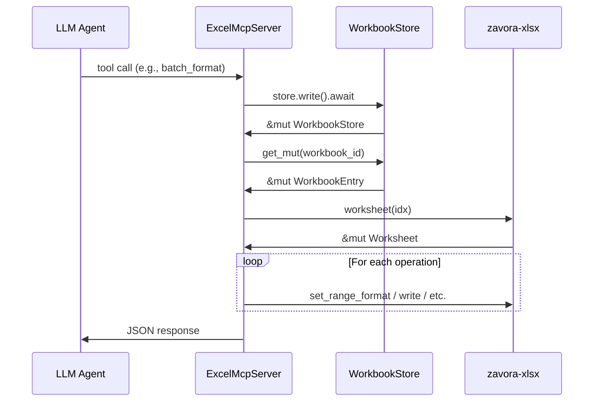

# Design Document: High-Level Operations

## Overview

This feature adds ~20 new high-level MCP tools to the excel-mcp-server that compose existing zavora-xlsx primitives into single-call operations. The tools target three agent personas:

- **Styler agent**: Reduce formatting tool calls by 10-80× via batch formatting, themes, style presets, and format copying
- **Writer agent**: Reduce data/formula writing tool calls by 5-60× via grid writes, drag-fill formulas, and column cloning
- **Data operations**: Sort, find-replace, fill series, delete-rows-where, copy-sheet, copy-range, transpose, remove-duplicates, split-column

All new tools follow the existing codebase patterns: `workbook_id` + `sheet_name` targeting, A1 notation, `#[serde(deny_unknown_fields)]` input structs, `tool_fn!` macro for async store access, and structured JSON responses via `success()`/`error()`.

### Design Rationale

The key design decision is to implement these as **server-side compositions** rather than client-side orchestration. This is because:

1. Each MCP tool call has network round-trip overhead — batching N operations into 1 call eliminates N-1 round trips
2. LLM agents have limited context windows — fewer tool calls means more room for reasoning
3. Server-side atomicity is simpler — the server can validate all inputs before applying any changes

### New Tool Summary

| Tool | Module | Tier | Calls Saved |
|------|--------|------|-------------|
| `batch_format` | `format.rs` | 1 | 15-20× |
| `apply_theme` | `format.rs` | 1 | 15-20× |
| `copy_format` | `format.rs` | 1 | 5-10× |
| `apply_style` | `format.rs` | 1 | 2-5× |
| `format_as_table_header` | `format.rs` | 1 | 4× |
| `format_as_table_range` | `format.rs` | 1 | 5-10× |
| `describe_formatting` | `read.rs` | 1 | new capability |
| `write_grid` | `write.rs` | 2 | 5-60× |
| `write_row_range` | `write.rs` | 2 | 5-20× |
| `clone_column_formulas` | `write.rs` | 2 | 10-60× |
| `sort_range` | `data.rs` (new) | 3 | new capability |
| `find_replace` | `data.rs` | 3 | new capability |
| `fill_series` | `data.rs` | 3 | 10-100× |
| `delete_rows_where` | `data.rs` | 3 | new capability |
| `copy_sheet` | `sheets.rs` | 3 | new capability |
| `copy_range` | `data.rs` | 3 | new capability |
| `transpose_range` | `data.rs` | 3 | new capability |
| `remove_duplicates` | `data.rs` | 3 | new capability |
| `split_column` | `data.rs` | 3 | new capability |

## Architecture

### Module Organization

New tools are distributed across existing and new modules to maintain cohesion:

```
src/tools/
├── format.rs      ← batch_format, apply_theme, copy_format, apply_style,
│                    format_as_table_header, format_as_table_range
│                    (+ semantic format resolution, comma-separated range updates)
├── read.rs        ← describe_formatting
├── write.rs       ← write_grid, write_row_range, clone_column_formulas
├── sheets.rs      ← copy_sheet
├── data.rs (NEW)  ← sort_range, find_replace, fill_series, delete_rows_where,
│                    copy_range, transpose_range, remove_duplicates, split_column
├── common.rs      ← shared helpers (resolve_semantic_format, parse_multi_range,
│                    adjust_formula_references)
└── mod.rs         ← add `pub mod data;`
```

### Shared Helpers in `common.rs`

Three new helper functions are added to `common.rs` to avoid duplication:

```rust
/// Parse a comma-separated range string into individual (r1,c1,r2,c2) tuples.
/// Trims whitespace around each segment. Returns Err identifying the invalid segment.
pub fn parse_multi_range(range: &str) -> Result<Vec<(u32, u16, u32, u16)>, String>;

/// Resolve a semantic format name to an Excel format code.
/// Returns the mapped code for known names, or the input unchanged for unknown strings.
pub fn resolve_semantic_format(name: &str) -> &str;

/// Adjust column references in a formula by a given offset.
/// Relative references (e.g., B10) are shifted; absolute references ($B$10, $B10) are preserved.
pub fn adjust_formula_col_refs(formula: &str, col_offset: i16) -> String;
```

### Control Flow

All new tools follow the existing pattern:



### Registration in `server.rs`

Each new tool is registered in `server.rs` using the `#[tool]` attribute and `tool_fn!` macro, following the existing pattern. New tools are grouped under comment headers:

```rust
// ── High-level formatting (6) ──
// ── High-level writing (3) ──
// ── Data operations (8) ──
```

### Modifications to Existing Tools

1. **`merge_cells`** in `format.rs`: Add comma-separated range support (split on comma, merge each independently)
2. **`add_conditional_format`** in `conditional.rs`: Add comma-separated range support
3. **`set_dimensions`** in `expanded.rs`: Add comma-separated range support
4. **`set_cell_format`** in `format.rs`: Add semantic format resolution before applying `number_format`
5. **`write_cells`** tool description: Update to mention formula auto-detection
6. **`write_formula`** tool description: Update to recommend `write_cells` for regular formulas

## Components and Interfaces

### New Enums (`src/types/enums.rs`)

```rust
#[derive(Deserialize, JsonSchema)]
#[serde(rename_all = "snake_case")]
pub enum SortDirection {
    Ascending,
    Descending,
}

#[derive(Deserialize, JsonSchema)]
#[serde(rename_all = "snake_case")]
pub enum FillDirection {
    Down,
    Right,
}

#[derive(Deserialize, JsonSchema)]
#[serde(rename_all = "snake_case")]
pub enum FillType {
    Linear,
    Date,
    Copy,
}

#[derive(Deserialize, JsonSchema)]
#[serde(rename_all = "snake_case")]
pub enum ConditionOperator {
    Equals,
    NotEquals,
    Contains,
    GreaterThan,
    LessThan,
    StartsWith,
    EndsWith,
    IsEmpty,
}
```

### New Input Structs (`src/types/inputs.rs`)

#### Tier 1: Styler Agent

```rust
/// A single formatting operation for batch_format
#[derive(Deserialize, JsonSchema)]
#[serde(deny_unknown_fields)]
pub struct FormatOperation {
    /// Range in A1:B2 notation (supports comma-separated multi-range)
    pub range: String,
    #[serde(default)]
    pub bold: Option<bool>,
    #[serde(default)]
    pub italic: Option<bool>,
    #[serde(default)]
    pub underline: Option<bool>,
    #[serde(default)]
    pub font_size: Option<f64>,
    #[serde(default)]
    pub font_color: Option<String>,
    #[serde(default)]
    pub background_color: Option<String>,
    /// Excel number format string or semantic name ("currency", "percentage", etc.)
    #[serde(default)]
    pub number_format: Option<String>,
    #[serde(default)]
    pub horizontal_alignment: Option<HorizontalAlignment>,
    #[serde(default)]
    pub vertical_alignment: Option<VerticalAlignment>,
    /// Border style enum or preset name ("bottom_thick", "box", "top_bottom", etc.)
    #[serde(default)]
    pub border_style: Option<BorderStyle>,
}

/// Input for batch_format: apply multiple formatting operations in one call
#[derive(Deserialize, JsonSchema)]
#[serde(deny_unknown_fields)]
pub struct BatchFormatInput {
    pub workbook_id: String,
    pub sheet_name: String,
    /// Array of formatting operations to apply sequentially
    pub operations: Vec<FormatOperation>,
}

/// Input for apply_theme: apply a complete professional theme to a sheet
#[derive(Deserialize, JsonSchema)]
#[serde(deny_unknown_fields)]
pub struct ApplyThemeInput {
    pub workbook_id: String,
    pub sheet_name: String,
    /// Theme name: "financial_professional", "corporate", "minimal"
    pub theme: String,
    /// Row numbers (1-based) to style as headers
    #[serde(default)]
    pub header_rows: Vec<u32>,
    /// Row numbers (1-based) to style as totals
    #[serde(default)]
    pub total_rows: Vec<u32>,
    /// If true, auto-detect numeric columns and apply currency format. Default: false.
    /// Use with caution — columns of years or IDs will be incorrectly formatted.
    #[serde(default)]
    pub auto_detect_formats: bool,
}

/// Input for copy_format: copy formatting from source to target ranges
#[derive(Deserialize, JsonSchema)]
#[serde(deny_unknown_fields)]
pub struct CopyFormatInput {
    pub workbook_id: String,
    pub sheet_name: String,
    /// Source range to copy formatting from (A1:B2 notation)
    pub source_range: String,
    /// Target ranges to apply formatting to (comma-separated A1:B2 notation)
    pub target_ranges: Vec<String>,
}

/// Input for apply_style: apply a named style preset to a range
#[derive(Deserialize, JsonSchema)]
#[serde(deny_unknown_fields)]
pub struct ApplyStyleInput {
    pub workbook_id: String,
    pub sheet_name: String,
    /// Range in A1:B2 notation (supports comma-separated)
    pub range: String,
    /// Style preset: "header", "title", "currency", "percentage", "date",
    /// "number", "text", "accounting", "total"
    pub style: String,
}

/// Input for format_as_table_header: format a row as a table header
#[derive(Deserialize, JsonSchema)]
#[serde(deny_unknown_fields)]
pub struct FormatAsTableHeaderInput {
    pub workbook_id: String,
    pub sheet_name: String,
    /// Row number to format as header (1-based). Default: 1
    #[serde(default)]
    pub header_row: Option<u32>,
    /// Override header background color (hex). Default: "#4472C4"
    #[serde(default)]
    pub background_color: Option<String>,
    /// Override header font color (hex). Default: "#FFFFFF"
    #[serde(default)]
    pub font_color: Option<String>,
}

/// Input for format_as_table_range: apply table-like formatting to a range
#[derive(Deserialize, JsonSchema)]
#[serde(deny_unknown_fields)]
pub struct FormatAsTableRangeInput {
    pub workbook_id: String,
    pub sheet_name: String,
    /// Range in A1:B2 notation
    pub range: String,
    /// Color scheme: "blue" (default), "green", "gray", "orange"
    #[serde(default)]
    pub style: Option<String>,
}

/// Input for describe_formatting: read formatting from a range
#[derive(Deserialize, JsonSchema)]
#[serde(deny_unknown_fields)]
pub struct DescribeFormattingInput {
    pub workbook_id: String,
    pub sheet_name: String,
    /// Range in A1:B2 notation
    pub range: String,
}
```

#### Tier 2: Writer Agent

```rust
/// Input for write_grid: write a 2D block of data
#[derive(Deserialize, JsonSchema)]
#[serde(deny_unknown_fields)]
pub struct WriteGridInput {
    pub workbook_id: String,
    pub sheet_name: String,
    /// Top-left cell where the grid starts (A1 notation)
    pub start_cell: String,
    /// 2D array of rows, each row is an array of values.
    /// Strings starting with "=" are formulas. Numbers, booleans, ISO dates auto-detected.
    pub rows: Vec<Vec<serde_json::Value>>,
}

/// Input for write_row_range: write a formula and fill rightward with reference adjustment
#[derive(Deserialize, JsonSchema)]
#[serde(deny_unknown_fields)]
pub struct WriteRowRangeInput {
    pub workbook_id: String,
    pub sheet_name: String,
    /// Starting cell (A1 notation)
    pub start_cell: String,
    /// End column letter (inclusive). Formula fills from start_cell column to this column.
    pub end_column: String,
    /// Formula to write. Accepts with or without leading "=".
    /// Both "=B10*(1+0.05)" and "B10*(1+0.05)" are valid.
    /// Relative references adjust rightward.
    pub formula: String,
}

/// Input for clone_column_formulas: copy formulas from one column to others
#[derive(Deserialize, JsonSchema)]
#[serde(deny_unknown_fields)]
pub struct CloneColumnFormulasInput {
    pub workbook_id: String,
    pub sheet_name: String,
    /// Source column letter (e.g., "C")
    pub source_column: String,
    /// Target column letters (e.g., ["D", "E", "F", "G"])
    pub target_columns: Vec<String>,
    /// First row of the range (1-based)
    pub start_row: u32,
    /// Last row of the range (1-based)
    pub end_row: u32,
}
```

#### Tier 3: Data Operations

```rust
/// A sort key specifying column and direction
#[derive(Deserialize, JsonSchema)]
pub struct SortKey {
    /// Column letter within the range (e.g., "A", "B")
    pub column: String,
    /// Sort direction. Default: ascending
    #[serde(default)]
    pub direction: Option<SortDirection>,
}

/// Input for sort_range
#[derive(Deserialize, JsonSchema)]
#[serde(deny_unknown_fields)]
pub struct SortRangeInput {
    pub workbook_id: String,
    pub sheet_name: String,
    /// Range to sort in A1:B2 notation
    pub range: String,
    /// Sort keys in priority order (first = primary sort)
    pub sort_keys: Vec<SortKey>,
    /// Whether the first row is a header (excluded from sorting). Default: false
    #[serde(default)]
    pub has_header: bool,
}

/// Input for find_replace
#[derive(Deserialize, JsonSchema)]
#[serde(deny_unknown_fields)]
pub struct FindReplaceInput {
    pub workbook_id: String,
    pub sheet_name: String,
    /// Value to find
    pub find: String,
    /// Value to replace with
    pub replace: String,
    /// Optional range to limit search (A1:B2 notation). If omitted, searches entire sheet.
    #[serde(default)]
    pub range: Option<String>,
    /// Whether to match case. Default: true
    #[serde(default = "default_true")]
    pub match_case: bool,
}

/// Input for fill_series
#[derive(Deserialize, JsonSchema)]
#[serde(deny_unknown_fields)]
pub struct FillSeriesInput {
    pub workbook_id: String,
    pub sheet_name: String,
    /// Source range containing seed values (A1:A3 notation)
    pub source_range: String,
    /// Number of cells to fill beyond the source
    pub fill_count: u32,
    /// Direction to fill. Default: "down"
    #[serde(default)]
    pub direction: Option<FillDirection>,
    /// Fill type. Default: "linear"
    #[serde(default)]
    pub fill_type: Option<FillType>,
}

/// A condition for filtering rows
#[derive(Deserialize, JsonSchema)]
pub struct RowCondition {
    /// Column letter to evaluate
    pub column: String,
    /// Comparison operator
    pub operator: ConditionOperator,
    /// Value to compare against (ignored for is_empty)
    #[serde(default)]
    pub value: Option<String>,
}

/// Input for delete_rows_where
#[derive(Deserialize, JsonSchema)]
#[serde(deny_unknown_fields)]
pub struct DeleteRowsWhereInput {
    pub workbook_id: String,
    pub sheet_name: String,
    /// Condition to match rows for deletion
    pub condition: RowCondition,
    /// Whether the first row is a header (excluded from deletion). Default: false
    #[serde(default)]
    pub has_header: bool,
}

/// Input for copy_sheet
#[derive(Deserialize, JsonSchema)]
#[serde(deny_unknown_fields)]
pub struct CopySheetInput {
    pub workbook_id: String,
    /// Name of the source sheet to copy
    pub source_sheet: String,
    /// Name for the new copy
    pub new_sheet_name: String,
}

/// Input for copy_range
#[derive(Deserialize, JsonSchema)]
#[serde(deny_unknown_fields)]
pub struct CopyRangeInput {
    pub workbook_id: String,
    /// Source sheet name
    pub source_sheet: String,
    /// Source range in A1:B2 notation
    pub source_range: String,
    /// Destination sheet name (can differ from source for cross-sheet copy)
    #[serde(default)]
    pub destination_sheet: Option<String>,
    /// Top-left cell of the destination (A1 notation)
    pub destination_cell: String,
}

/// Input for transpose_range
#[derive(Deserialize, JsonSchema)]
#[serde(deny_unknown_fields)]
pub struct TransposeRangeInput {
    pub workbook_id: String,
    pub sheet_name: String,
    /// Source range in A1:B2 notation
    pub source_range: String,
    /// Destination top-left cell. If omitted, writes back to source range origin.
    #[serde(default)]
    pub destination_cell: Option<String>,
}

/// Input for remove_duplicates
#[derive(Deserialize, JsonSchema)]
#[serde(deny_unknown_fields)]
pub struct RemoveDuplicatesInput {
    pub workbook_id: String,
    pub sheet_name: String,
    /// Range to deduplicate in A1:B2 notation
    pub range: String,
    /// Column letters to compare for duplicates. If empty, compares all columns.
    #[serde(default)]
    pub columns: Vec<String>,
    /// Whether the first row is a header (excluded from dedup). Default: false
    #[serde(default)]
    pub has_header: bool,
}

/// Input for split_column
#[derive(Deserialize, JsonSchema)]
#[serde(deny_unknown_fields)]
pub struct SplitColumnInput {
    pub workbook_id: String,
    pub sheet_name: String,
    /// Column letter to split (e.g., "C")
    pub column: String,
    /// First row (1-based)
    pub start_row: u32,
    /// Last row (1-based)
    pub end_row: u32,
    /// Delimiter to split on. Default: ","
    #[serde(default = "default_comma")]
    pub delimiter: String,
    /// Whether the first row is a header (excluded from splitting). Default: false
    #[serde(default)]
    pub has_header: bool,
}
```

### New Response Structs (`src/types/responses.rs`)

```rust
/// Result from batch_format
#[derive(Debug, Serialize)]
pub struct BatchFormatResult {
    pub operations_applied: usize,
    pub failures: Vec<BatchFormatFailure>,
}

#[derive(Debug, Serialize)]
pub struct BatchFormatFailure {
    pub operation_index: usize,
    pub range: String,
    pub error: String,
}

/// Result from write_grid
#[derive(Debug, Serialize)]
pub struct WriteGridResult {
    pub rows_written: usize,
    pub columns_written: usize,
    pub cells_written: usize,
    pub failures: Vec<String>,
}

/// Result from sort_range
#[derive(Debug, Serialize)]
pub struct SortResult {
    pub rows_sorted: usize,
}

/// Result from find_replace
#[derive(Debug, Serialize)]
pub struct FindReplaceResult {
    pub replacements: usize,
}

/// Result from fill_series
#[derive(Debug, Serialize)]
pub struct FillSeriesResult {
    pub cells_filled: usize,
}

/// Result from delete_rows_where
#[derive(Debug, Serialize)]
pub struct DeleteRowsResult {
    pub rows_deleted: usize,
}

/// Result from transpose_range
#[derive(Debug, Serialize)]
pub struct TransposeResult {
    pub original_rows: usize,
    pub original_columns: usize,
    pub transposed_rows: usize,
    pub transposed_columns: usize,
}

/// Result from remove_duplicates
#[derive(Debug, Serialize)]
pub struct RemoveDuplicatesResult {
    pub rows_removed: usize,
    pub rows_remaining: usize,
}

/// Result from split_column
#[derive(Debug, Serialize)]
pub struct SplitColumnResult {
    pub rows_split: usize,
    pub output_columns: usize,
}

/// Result from clone_column_formulas
#[derive(Debug, Serialize)]
pub struct CloneFormulasResult {
    pub formulas_cloned: usize,
    pub columns_filled: usize,
}

/// Result from describe_formatting
#[derive(Debug, Serialize)]
pub struct DescribeFormattingResult {
    pub format_groups: Vec<FormatGroup>,
}

#[derive(Debug, Serialize)]
pub struct FormatGroup {
    pub ranges: Vec<String>,
    pub bold: Option<bool>,
    pub italic: Option<bool>,
    pub underline: Option<bool>,
    pub font_size: Option<f64>,
    pub font_color: Option<String>,
    pub background_color: Option<String>,
    pub number_format: Option<String>,
    pub horizontal_alignment: Option<String>,
    pub vertical_alignment: Option<String>,
    pub border_style: Option<String>,
}

/// Result from write_row_range
#[derive(Debug, Serialize)]
pub struct WriteRowRangeResult {
    pub cells_written: usize,
}

/// Result from copy_format
#[derive(Debug, Serialize)]
pub struct CopyFormatResult {
    pub targets_formatted: usize,
    pub note: Option<String>,
}
```

## Data Models

### Semantic Format Mapping

The `resolve_semantic_format` function in `common.rs` maps human-readable names to Excel format codes:

| Semantic Name | Excel Format Code |
|---------------|-------------------|
| `"currency"` | `"$#,##0.00"` |
| `"percentage"` | `"0.0%"` |
| `"accounting"` | `'_($* #,##0.00_);_($* (#,##0.00);_($* "-"??_);_(@_)'` |
| `"multiple"` | `'0.0"x"'` |
| `"date"` | `"yyyy-mm-dd"` |
| `"number"` | `"#,##0"` |
| `"integer"` | `"#,##0"` |
| `"text"` | `"@"` |
| `"decimal"` | `"#,##0.00"` |

Any string not in this table passes through unchanged as a literal Excel format code.

### Border Preset Mapping

Border presets map to specific border configurations applied via `zavora_xlsx::Format`:

| Preset Name | Configuration |
|-------------|---------------|
| `"bottom_thick"` | Bottom border: thick |
| `"box"` | All four sides: thin |
| `"top_bottom"` | Top and bottom: thin |
| `"accounting_underline"` | Bottom: thin, top: thin (on total rows) |
| `"none"` | All borders: none |

### Style Preset Mapping

| Preset Name | Formatting |
|-------------|------------|
| `"header"` | Bold, font #FFFFFF, bg #4472C4, center align |
| `"title"` | Bold, font size 14, font #1F3864 |
| `"currency"` | Number format `$#,##0.00` |
| `"percentage"` | Number format `0.0%` |
| `"date"` | Number format `yyyy-mm-dd` |
| `"number"` | Number format `#,##0` |
| `"text"` | Number format `@` |
| `"accounting"` | Number format accounting style |
| `"total"` | Bold, top border thin |

### Theme Definitions

#### `financial_professional`
- **Headers**: Bold, white font (#FFFFFF), dark blue bg (#1F3864), center align
- **Totals**: Bold, top border (medium)
- **Data rows**: Alternating light blue (#D6E4F0) / white
- **Currency columns**: Auto-detected, format `$#,##0.00`
- **Columns**: Autofitted

#### `corporate`
- **Headers**: Bold, dark font (#333333), light gray bg (#E0E0E0), thin bottom border
- **Totals**: Bold, thin top border
- **Data rows**: No alternating colors, subtle thin borders
- **Columns**: Autofitted

#### `minimal`
- **Headers**: Bold, thin bottom border
- **Totals**: Bold, thin bottom border
- **Data rows**: No background colors, no borders
- **Columns**: Autofitted

### Table Range Color Schemes

| Style | Header BG | Header Font | Alternating Row BG |
|-------|-----------|-------------|-------------------|
| `"blue"` (default) | #4472C4 | #FFFFFF | #D6E4F0 |
| `"green"` | #548235 | #FFFFFF | #E2EFDA |
| `"gray"` | #808080 | #FFFFFF | #F2F2F2 |
| `"orange"` | #ED7D31 | #FFFFFF | #FCE4D6 |

### Formula Reference Adjustment Algorithm

The `adjust_formula_col_refs` function parses formula strings and adjusts column references:

1. Tokenize the formula into cell references and non-reference text
2. For each cell reference (e.g., `B10`, `$B$10`, `$B10`, `B$10`):
   - If the column part starts with `$`, it is absolute — leave unchanged
   - Otherwise, convert column letter(s) to a 0-based index, add the offset, convert back to letter(s)
3. Reassemble the formula

This handles multi-letter columns (AA, AB, etc.) and mixed absolute/relative references.

**Critical edge cases for `adjust_formula_col_refs`:**
- Sheet references: `Sheet2!B10` — the `Sheet2!` prefix must be preserved, only `B10` adjusts
- Range references: `SUM(B10:B20)` — both `B10` and `B20` adjust independently
- Nested functions: `IF(B10>0, B10*C10, 0)` — all three references adjust
- String literals: `"Cell B10"` — text inside quotes must NOT be adjusted (not a real reference)
- Mixed absolute/relative: `$B10` (absolute column, relative row) — column does NOT adjust; `B$10` (relative column, absolute row) — column DOES adjust

### Sort Algorithm

The sort implementation:
1. Read all cell values in the range into a `Vec<Vec<CellValue>>`
2. If `has_header`, separate the first row
3. Sort the rows using Rust's stable sort with a comparator that:
   - Compares by primary key first, then secondary, etc.
   - Numbers compare numerically, strings lexicographically
   - Empty cells sort last
4. Write the sorted rows back to the worksheet
5. Formatting is preserved because we read values and write them back to the same cells (the format stays on the cell positions)

**Design decision**: We sort values in memory and write them back rather than trying to move entire rows with formatting. This is simpler and avoids complex row-swapping logic in zavora-xlsx. The trade-off is that formatting stays with cell positions rather than moving with data. This matches the requirement "preserve cell formatting after sorting" — the formatting on each cell position is unchanged. **The tool description MUST document this clearly** so the LLM knows formatting doesn't move with data (e.g., "Note: formatting stays on cell positions — it does not move with the sorted data. Apply formatting after sorting if needed.").

## Correctness Properties

*A property is a characteristic or behavior that should hold true across all valid executions of a system — essentially, a formal statement about what the system should do. Properties serve as the bridge between human-readable specifications and machine-verifiable correctness guarantees.*

### Property 1: Semantic Format Resolution Consistency

*For any* string input to `resolve_semantic_format`, if the string is a recognized semantic name (e.g., "currency", "percentage"), the function SHALL return the corresponding Excel format code; if the string is not recognized, the function SHALL return the input string unchanged.

**Validates: Requirements 5.1, 5.3, 2.6**

### Property 2: Batch Format Equivalence

*For any* array of N format operations, applying them via `batch_format` SHALL produce the same cell formatting as applying each operation individually via `set_cell_format` in the same order.

**Validates: Requirements 2.1, 2.4**

### Property 3: Comma-Separated Range Atomicity

*For any* comma-separated range string where at least one segment is invalid, the server SHALL not apply formatting to any segment and SHALL return an error identifying the invalid segment.

**Validates: Requirements 1.6**

### Property 4: Copy Format Fidelity

*For any* source range with formatting and any target range, after `copy_format`, each cell in the target range SHALL have formatting identical to the corresponding cell in the source range (with tiling for targets larger than the source).

**Validates: Requirements 4.1, 4.3, 4.4**

### Property 5: Write Grid Round-Trip

*For any* 2D array of JSON values (numbers, strings, booleans), writing via `write_grid` at a start cell and then reading back the same range SHALL produce equivalent values, and the returned dimensions SHALL match the input array's rows × columns.

**Validates: Requirements 10.1, 10.3**

### Property 6: Formula Reference Adjustment

*For any* formula string and column offset N, `adjust_formula_col_refs` SHALL shift all relative column references by exactly N positions and SHALL leave all absolute column references (prefixed with `$`) unchanged.

**Validates: Requirements 11.2, 11.3, 12.1, 12.2, 12.3**

### Property 7: Sort Correctness

*For any* data range and sort keys, after `sort_range`, the rows SHALL be ordered according to the sort keys in priority order, and if `has_header` is true, the first row SHALL remain in its original position.

**Validates: Requirements 14.1, 14.2, 14.3**

### Property 8: Transpose Involution

*For any* rectangular data range, transposing twice SHALL restore the original data layout, and the transposed dimensions SHALL be the original dimensions with rows and columns swapped.

**Validates: Requirements 20.1, 20.3**

### Property 9: Delete Rows Completeness

*For any* condition and data range, after `delete_rows_where`, no remaining non-header row SHALL match the specified condition, and the header row (if `has_header` is true) SHALL remain unchanged.

**Validates: Requirements 17.1, 17.5**

### Property 10: Remove Duplicates Uniqueness

*For any* data range and column set, after `remove_duplicates`, no two remaining non-header rows SHALL have identical values in the specified columns, and the first occurrence of each unique combination SHALL be preserved.

**Validates: Requirements 21.1, 21.4**

### Property 11: Find-Replace Completeness

*For any* find string and data range, after `find_replace`, no cell in the range SHALL contain the find string (respecting the `match_case` setting), and the returned count SHALL equal the number of replacements made.

**Validates: Requirements 15.1, 15.3**

### Property 12: Fill Series Linear Continuation

*For any* sequence of two or more numeric seed values with a constant arithmetic step, `fill_series` with `fill_type: "linear"` SHALL produce values that continue the same arithmetic progression.

**Validates: Requirements 16.2**

### Property 13: Fill Series Copy Cycling

*For any* sequence of seed values and fill count, `fill_series` with `fill_type: "copy"` SHALL produce values that repeat the seed values cyclically.

**Validates: Requirements 16.4**

### Property 14: Split Column Round-Trip

*For any* cell value containing a delimiter, splitting by that delimiter and then joining the resulting parts with the same delimiter SHALL reconstruct the original value.

**Validates: Requirements 22.1**

### Property 15: Format as Table Range Consistency

*For any* range with at least 2 rows, after `format_as_table_range`, the first row SHALL have header styling (bold, background color, white font), all cells SHALL have thin borders, and data rows SHALL have alternating background shading.

**Validates: Requirements 7.1, 7.2, 7.3**

## Error Handling

All new tools follow the existing error handling patterns using `ErrorCategory` variants:

| Error Condition | Category | Example |
|----------------|----------|---------|
| Workbook ID not found | `NotFound` | `workbook_not_found(store, id)` |
| Sheet name not found | `NotFound` | `sheet_err(name)` |
| Invalid cell/range reference | `ParseError` | `"Invalid range 'XYZ': ..."` |
| Invalid theme/preset name | `InvalidInput` | `"Unknown theme 'foo'. Valid: financial_professional, corporate, minimal"` |
| Invalid sort key column | `InvalidInput` | `"Sort key column 'Z' is outside range A1:E10"` |
| Empty sheet (for format_as_table_header) | `InvalidInput` | `"Sheet is empty — no data to format"` |
| Duplicate sheet name (copy_sheet) | `InvalidInput` | `"Sheet 'Copy' already exists"` |
| Start column >= end column (write_row_range) | `InvalidInput` | `"Start column D >= end column C"` |

### Partial Failure Handling

Two tools support partial failure (continue on error):

1. **`batch_format`**: If one operation fails, remaining operations still execute. The response includes both `operations_applied` count and a `failures` array with `{operation_index, range, error}` for each failure.

2. **`write_grid`**: If one cell write fails, remaining cells still execute. The response includes `cells_written` count and a `failures` array with error descriptions.

All other tools are atomic — they validate inputs before making changes and return an error without partial application if validation fails.

## Testing Strategy

### Dual Testing Approach

This feature uses both unit tests and property-based tests:

- **Property-based tests** (using `proptest` crate, already in `dev-dependencies`): Verify universal properties across randomly generated inputs. Minimum 100 iterations per property.
- **Unit tests**: Verify specific examples, edge cases, integration points, and error conditions.

### Property-Based Test Plan

Each correctness property maps to a property-based test. Tests are tagged with the format:
`Feature: high-level-operations, Property {N}: {title}`

| Property | Test Description | Generator Strategy |
|----------|-----------------|-------------------|
| 1: Semantic Format Resolution | Generate random strings (mix of known semantic names and arbitrary strings), verify mapping | `prop_oneof![Just("currency"), Just("percentage"), ..., "[a-zA-Z0-9#,.]{1,20}"]` |
| 2: Batch Format Equivalence | Generate 1-5 format operations with random properties, compare batch vs sequential | Random `FormatOperation` arrays with random ranges and format properties |
| 3: Comma-Separated Range Atomicity | Generate valid range lists, inject one invalid range at random position | Valid ranges + one malformed range |
| 4: Copy Format Fidelity | Set random formatting on source, copy to target, read back and compare | Random format properties, random source/target ranges |
| 5: Write Grid Round-Trip | Generate random 2D arrays (1-10 rows, 1-10 cols), write and read back | `Vec<Vec<Value>>` with numbers, strings, booleans |
| 6: Formula Reference Adjustment | Generate formulas with mixed absolute/relative refs, apply random offsets | Formula strings with cell references, random i16 offsets |
| 7: Sort Correctness | Generate random data grids, random sort keys, verify ordering | Random numeric/string data, 1-3 sort keys |
| 8: Transpose Involution | Generate random data grids, transpose twice, compare to original | Random 1-10 × 1-10 grids |
| 9: Delete Rows Completeness | Generate data with known matching rows, delete, verify none remain | Random data with seeded matches |
| 10: Remove Duplicates Uniqueness | Generate data with known duplicates, dedup, verify uniqueness | Random data with seeded duplicates |
| 11: Find-Replace Completeness | Generate data with known occurrences, replace, verify none remain | Random strings with seeded find values |
| 12: Fill Series Linear | Generate arithmetic sequences (2-5 seeds), fill, verify continuation | Random start + step values |
| 13: Fill Series Copy | Generate seed arrays, fill, verify cyclic repetition | Random 1-5 seed values |
| 14: Split Column Round-Trip | Generate strings with delimiters, split, join, compare | Random strings containing the delimiter |
| 15: Table Range Consistency | Generate ranges, apply table formatting, verify header/borders/banding | Random range sizes (2-20 rows, 1-10 cols) |

### Unit Test Plan

| Test | What It Verifies |
|------|-----------------|
| `test_semantic_format_known_names` | Each semantic name maps to the correct Excel code |
| `test_semantic_format_passthrough` | Unknown strings pass through unchanged |
| `test_batch_format_empty_operations` | Empty operations array returns success with 0 count |
| `test_batch_format_partial_failure` | Mix of valid/invalid operations, valid ones applied |
| `test_apply_theme_financial` | Financial theme applies correct colors/styles |
| `test_apply_theme_corporate` | Corporate theme applies correct colors/styles |
| `test_apply_theme_minimal` | Minimal theme applies correct styles |
| `test_apply_theme_invalid_name` | Invalid theme name returns error with valid names |
| `test_copy_format_no_formatting` | Source with no formatting returns success note |
| `test_copy_format_tiling` | Smaller source tiles into larger target |
| `test_apply_style_each_preset` | Each style preset applies correct formatting |
| `test_apply_style_invalid_name` | Invalid preset returns error with valid names |
| `test_format_table_header_defaults` | Default header formatting (row 1, blue/white) |
| `test_format_table_header_custom_row` | Custom row number |
| `test_format_table_header_empty_sheet` | Empty sheet returns error |
| `test_format_table_range_default_blue` | Default blue color scheme |
| `test_format_table_range_each_style` | Each color scheme |
| `test_describe_formatting_empty` | Unformatted range returns empty list |
| `test_describe_formatting_grouped` | Identical formats grouped together |
| `test_write_grid_mixed_types` | Numbers, strings, formulas, booleans, dates |
| `test_write_grid_partial_failure` | Some invalid values, rest written |
| `test_write_row_range_basic` | Formula fills rightward with ref adjustment |
| `test_write_row_range_absolute_refs` | $A$1 preserved during fill |
| `test_write_row_range_invalid_columns` | Start >= end returns error |
| `test_clone_column_no_formulas` | Source with no formulas returns 0 count |
| `test_clone_column_skips_values` | Non-formula cells not copied |
| `test_sort_single_key` | Single column ascending sort |
| `test_sort_multi_key` | Primary + secondary sort |
| `test_sort_with_header` | Header row preserved |
| `test_sort_key_outside_range` | Invalid column returns error |
| `test_find_replace_case_insensitive` | Case-insensitive matching |
| `test_find_replace_no_matches` | No matches returns count 0 |
| `test_find_replace_in_range` | Limited to specified range |
| `test_fill_series_linear_integers` | 1,2,3 → 4,5,6 |
| `test_fill_series_copy` | A,B,C → A,B,C,A,B,C |
| `test_fill_series_date` | Date sequence continuation |
| `test_delete_rows_each_operator` | Each condition operator |
| `test_delete_rows_with_header` | Header preserved |
| `test_copy_sheet_basic` | Data and formatting copied |
| `test_copy_sheet_not_found` | Source not found error |
| `test_copy_sheet_duplicate_name` | Duplicate name error |
| `test_copy_range_same_sheet` | Same-sheet copy |
| `test_copy_range_cross_sheet` | Cross-sheet copy |
| `test_transpose_basic` | 3×2 → 2×3 |
| `test_transpose_in_place` | No destination = write to source origin |
| `test_remove_duplicates_all_columns` | No columns specified = compare all |
| `test_remove_duplicates_specific_columns` | Compare subset of columns |
| `test_remove_duplicates_with_header` | Header preserved |
| `test_split_column_comma` | Default comma delimiter |
| `test_split_column_custom_delimiter` | Custom delimiter |
| `test_split_column_with_header` | Header row skipped |
| `test_comma_range_whitespace_trim` | " A1:B5 , D1:E5 " parsed correctly |
| `test_comma_range_invalid_segment` | One bad segment = error, no application |
